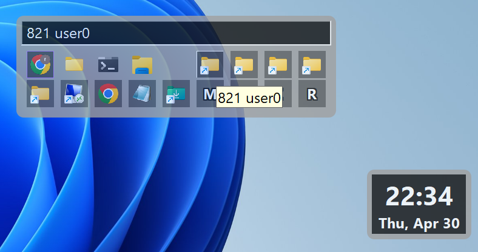

# hgfloater

[English](README.md) | **한국어**

hgfloater는 **윈도우 11 이상**을 위한 가벼운 데스크톱 유틸리티입니다. 반투명한 작은
위젯이 바탕화면에 떠 있고, 마우스를 올리면 대시보드가 펼쳐져 단축 아이콘 실행, 실행 중인
창 전환, 볼륨·밝기·투명도 조절, 명령 콘솔을 한 번의 조작으로 처리합니다. 순수 C와 Win32
API만으로 작성되어 외부 의존성이 전혀 없고, 즉시 실행되며 작업을 방해하지 않습니다.

> 이 문서는 영어판 [README.md](README.md)의 번역본입니다. 내용이 어긋날 경우 영어판이
> 기준입니다.

<!-- SKIP_START -->

<!-- SKIP_END -->

---

## 목차

1. [개요](#1-개요)
2. [설치와 첫 실행](#2-설치와-첫-실행)
3. [두 개의 창](#3-두-개의-창)
4. [플로터](#4-플로터)
5. [태스크박스](#5-태스크박스)
6. [툴바](#6-툴바)
7. [옵션 메뉴](#7-옵션-메뉴)
8. [커맨드 박스](#8-커맨드-박스)
9. [모니터 썸네일](#9-모니터-썸네일)
10. [노트](#10-노트)
11. [키보드 조작 요약](#11-키보드-조작-요약)
12. [마우스 조작 요약](#12-마우스-조작-요약)
13. [설정 파일](#13-설정-파일)
14. [파일과 디렉터리](#14-파일과-디렉터리)
15. [소스에서 빌드하기](#15-소스에서-빌드하기)
16. [프로젝트 구조](#16-프로젝트-구조)
17. [테스트와 검증](#17-테스트와-검증)
18. [제작자 정보](#18-제작자-정보)
19. [HellGates 시리즈](#19-hellgates-시리즈)
20. [라이선스](#20-라이선스)

---

## 1. 개요

hgfloater의 목표는 하나입니다. 기본 작업 표시줄보다 빠르게 데스크톱을 조작하는 것입니다.
**퀵 런처**, **태스크 스위처**, **시스템 제어판**(볼륨, 모니터별 밝기와 배율, 창 투명도,
화면 잠금), 창을 이름과 번호로 다루는 **커맨드 박스**, 그리고 **노트**까지 — 어느 모니터
어디에나 둘 수 있는 위젯 하나로 모두 접근합니다.

사용 전에 알아두면 좋은 설계 원칙입니다.

- **백그라운드에 아무것도 남기지 않습니다.** 서비스도, 설치 과정도, 레지스트리 키도
  없습니다. `hgfloater.exe` 파일 하나가 전부입니다.
- **폴더 하나에 평범한 파일로만 씁니다.** 설정은 사용자 프로필 아래 평범한 `config.ini`에,
  노트는 그 옆에 평범한 `.txt`로 저장됩니다. 데이터베이스가 아니라 전부 손으로 열어 고칠 수
  있는 파일이고, 로그·캐시·임시 파일은 만들지 않습니다.
- **모든 것을 그 자리에서 조절합니다.** 크기, 투명도, 글꼴 크기, 격자 모양, 색을 휠이나
  키보드로 즉시 바꾸고, 저장은 알아서 됩니다.
- **키보드와 마우스가 동등합니다.** 모든 동작에 포인터 제스처와 단축키가 모두 있습니다.
- **시스템 테마를 따릅니다.** 윈도우의 라이트/다크 모드를 바꾸면 즉시 색이 반전됩니다.

## 2. 설치와 첫 실행

1. **다운로드**: [Releases](https://github.com/rubidus-api/hgfloater/releases/tag/v26.07.29)
   페이지에서 최신 `hgfloater.exe`를 받습니다.
2. **실행**: 설치 과정이 없습니다. 첫 실행 시
   `%USERPROFILE%\.HellGates\hgfloater\` 폴더와 `config.ini`, `shortcuts` 폴더를 만들고
   플로터를 표시합니다.
3. **단축 아이콘 추가**: `%USERPROFILE%\.HellGates\hgfloater\shortcuts` 폴더에 `.lnk`나
   `.url` 파일을 넣으면 태스크박스에 자동으로 나타납니다. 태스크박스에서 `Esc`를 누르면
   폴더를 즉시 다시 읽습니다.
4. **어디서든 호출**: `Win + Alt + Space` (변경 가능).

동시에 하나만 실행됩니다. `hgfloater.exe`를 다시 실행하면 두 번째 인스턴스가 뜨는 대신
이미 실행 중인 쪽에 신호를 보냅니다.

## 3. 두 개의 창

hgfloater는 서로 자리를 바꾸는 두 개의 창으로 이루어집니다.

| 창 | 정체 | 나타나는 방법 |
| :--- | :--- | :--- |
| **플로터 (floater)** | 시계·날짜·PC 이름·시스템 막대가 있는 작은 항상 위 위젯 | 기본 상태 |
| **태스크박스 (taskbox)** | 실행 중인 창, 단축 아이콘, 툴바가 있는 대시보드 | 플로터에 마우스를 올리거나 클릭, 또는 전역 단축키 |

펼칠 때는 플로터를 중심으로 태스크박스를 배치한 뒤 해당 모니터의 작업 영역 안으로 완전히
밀어 넣습니다. 그래서 플로터가 화면 가장자리에 있어도 대시보드가 잘리지 않습니다. 접을
때는 플로터가 원래 자리로 돌아가며, 태스크박스를 열어 둔 채 옮겼다면 플로터도 같은 거리만큼
따라 이동합니다.

## 4. 플로터

플로터는 대기 상태입니다. 다른 창 위에 항상 떠 있는 작고 반투명한 패널입니다.

**표시되는 것**

- **시계와 날짜**: 1초마다 갱신되며 위젯 크기에 비례해 표시됩니다.
- **PC 이름**: 상단에 가느다란 한 줄로 표시됩니다.
- **상태 막대**: CPU·메모리·배터리의 가로 막대(빨강·파랑·초록)가 글자 뒤 전체 폭에 깔리고
  왼쪽 가장자리에 아주 작은 라벨이 붙습니다. 폭 전체가 100%입니다. 배터리가 없는 시스템에서는
  BAT 줄이 숨겨지고, 충전 중에는 라벨에 `+`가 붙습니다. `config.ini`에서 `show_stats=0`으로
  두면 줄 전체를 숨깁니다.

**조작**

- **마우스 올리기** — 그 자리에서 태스크박스를 엽니다. 태스크박스가 떠 있는 동안 플로터는
  스스로 숨습니다.
- **왼쪽 클릭** — 태스크박스를 토글합니다.
- **왼쪽 드래그** — 어느 모니터로든 옮깁니다.
- **Alt + 휠** — 투명도.
- **Ctrl + 휠** 또는 **Ctrl + 왼쪽 드래그** — 글꼴 크기(위젯 전체가 함께 커집니다).
- **Alt + 방향키 / WASD** — 키보드로 창 이동.
- **`T`** — 태스크박스 열기, **`C`** — 커맨드 박스, **`F1`** — 정보 창.

커서가 태스크박스를 벗어나면 약 0.5초의 유예 후 접힙니다. 가장자리를 살짝 스쳤다고 사라지지
않습니다.

## 5. 태스크박스

태스크박스는 아이콘 격자 위에 상태 표시줄이 있고 아래에 툴바 버튼이 붙은 구조입니다.

### 5.1 실행 중인 창과 단축 아이콘

- **작업 아이콘**이 먼저 옵니다. 표시되는 최상위 창마다 하나씩, 윈도우가 알려주는 순서대로
  놓입니다.
- **단축 아이콘**이 그 뒤를 잇습니다. 단축 아이콘 폴더의 `.lnk`/`.url` 하나당 하나입니다.
- **왼쪽 클릭**으로 해당 창으로 전환하거나 바로가기를 실행합니다.
- **왼쪽 드래그**로 작업 아이콘의 순서를 바꿉니다.
- **오른쪽 클릭**(또는 포커스된 아이콘에서 `Enter` / `F2`)으로 메뉴를 엽니다.
  - **Run (&R)** — 새 인스턴스 실행 또는 바로가기 실행
  - **Focus (&F)** — 이미 실행 중인 창으로 전환
  - **Close Window (&X)** — 작업 아이콘 전용
  - **Open File Location (&O)** — 단축 아이콘 전용

### 5.2 상태 표시줄

태스크박스 맨 위의 읽기 전용 한 줄 필드입니다.

- **한 번에 한 줄**만 표시합니다. 새 메시지가 이전 메시지를 대체합니다.
- 마지막 메시지로부터 10초가 지나면 **현재 시각**으로 바뀝니다. 형식은
  `2026. 11. 23.(Tue) 13:24`이며 분이 바뀔 때마다 갱신됩니다.
- **오른쪽 클릭**하면 옵션 메뉴(`O` 버튼과 동일)가 열립니다.
- **왼쪽 드래그**로 태스크박스 전체를 옮깁니다.
- 이 위에서 **Ctrl + 휠**을 돌리면 이 줄의 글꼴 크기만 바뀝니다.

### 5.3 모양과 크기

- **테두리 드래그**로 격자를 바꿉니다. 열 단위로 스냅되어 아이콘이 반쯤 잘리는 일이
  없습니다.
- **Ctrl + 휠**(또는 `Ctrl` + `+`/`-`)로 아이콘과 글자를 함께 키우고 창 비율을 유지합니다.
- **Alt + 휠**(또는 `Alt` + `+`/`-`)로 투명도를 바꿉니다.
- **`Ctrl` + `R`/`0` 또는 `F5`**로 위치·크기·투명도를 초기화합니다.

## 6. 툴바

내장 버튼 12개가 아이콘과 같은 격자에 놓입니다. 순서는 고정입니다.

| 버튼 | 클릭 | 드래그 / 휠 |
| :--- | :--- | :--- |
| **`R`** Resize | — | **드래그**로 격자 크기 조절 |
| **`M`** Move | **클릭**하면 스스로 비켜남(아래 참고) | **드래그**로 창 이동 |
| **`X`** Exit | hgfloater 종료 | — |
| **`D`** Desktop | 모든 창 최소화, 다시 누르면 복원 | — |
| **`O`** Options | [옵션 메뉴](#7-옵션-메뉴) 열기 | — |
| **`C`** Command | [커맨드 박스](#8-커맨드-박스) 열기 | — |
| **`A`** Alpha | — | **휠**로 태스크박스 투명도 조절. 값이 클수록 빨간 배경이 밝아짐 |
| **`B`** Brightness | — | **휠**로 화면 밝기를 5% 단위 조절. 값에 따라 초록 배경이 밝아짐 |
| **`V`** Volume | 음소거 토글. 음소거 중에는 굵은 강조 테두리 표시 | **휠**로 볼륨 조절. 값에 따라 파란 배경이 밝아짐 |
| **`F`** Floater | 플로터만 남기고 접어 조정 모드로 전환(아래 참고) | — |
| **`P`** Pin | 태스크박스를 열린 상태로 고정 | — |
| **`N`** Note | [노트 목록](#10-노트) 열기 | — |

**`M` — 비켜나기.** 드래그하지 않고 클릭하면, 방금 있던 영역을 딱 벗어날 만큼만 스스로
움직입니다. 진행 방향은 유지되므로 계속 누르면 같은 방향으로 화면을 가로질러 이동하고, 그
방향에 자리가 없으면 반시계 방향(북 → 서 → 남 → 동 → 다시 북)으로 꺾습니다. 갈 수 있는
방향이 없으면 움직이지 않습니다.

**`B` — 밝기.** 노트북 내장 화면과 외장 모니터를 모두 지원합니다. DDC/CI로 모니터에 먼저
요청하고, 하드웨어가 거부하면 감마 램프 방식으로 대체합니다.

**`F` — 플로터 조정.** 대시보드를 접고 호버 확장을 일시 정지하므로, 커서 아래에서
태스크박스가 다시 튀어나오는 일 없이 `Ctrl + 휠`(크기)과 `Alt + 휠`(투명도)로 플로터를
조정할 수 있습니다. 플로터를 클릭하면 돌아옵니다.

**`P` — 고정.** 고정된 동안에는 마우스를 치워도 태스크박스가 접히지 않고, 버튼에 강조
테두리가 표시됩니다. `X`, `Esc`, 전역 단축키, 플로터 클릭 같은 명시적인 닫기는 그대로
동작합니다. 다시 클릭하면 해제됩니다.

## 7. 옵션 메뉴

툴바 `O` 버튼을 누르거나 상태 표시줄을 오른쪽 클릭해 엽니다.

- **Open Shortcuts Folder** — 단축 아이콘 폴더를 탐색기로 엽니다.
- **Edit Configuration** — `config.ini`를 메모장으로 엽니다.
- **About...** — 이 문서를 앱 안에서 보여 줍니다.
- **Reset Settings** — 기본 위치·투명도·크기·색으로 되돌립니다.
- **Select Audio Device** — 출력 장치 목록(현재 장치에 체크)과 **Mute** 토글.
- **_(모니터마다 한 항목)_** — 연결된 모니터마다 하위 메뉴가 하나씩 붙고, 이름은 사람이
  부르는 방식 그대로입니다. 번호, 드라이버가 디스플레이의 EDID에서 읽어 온 모니터 이름,
  그리고 연결된 포트 순으로 `2. DELL U2720Q (DP)`처럼 표시됩니다. 각 하위 메뉴에는 그
  모니터에 할 수 있는 일이 모두 들어 있습니다.
  - **Preview Window** — 그 모니터의 [썸네일](#9-모니터-썸네일)을 켜고 끕니다.
  - **Scale** — 윈도우 디스플레이 배율(100, 125, 150, 175, 200, 225). 현재 배율에 체크
    표시가 붙고, 해당 모니터가 지원하지 않는 배율은 비활성화됩니다. 하나를 고르면 설정 앱과
    똑같이 그 모니터의 배율이 시스템 전체에 적용됩니다.
  - **Brightness** — 밝기를 25% 단위(0, 25, 50, 75, 100)로 조절합니다. 현재 밝기에 가장
    가까운 단계에 체크 표시가 붙습니다. DDC/CI에 응답하는 모니터는 백라이트를 직접 제어하고,
    응답하지 않으면 그 모니터의 감마 곡선만 조정하므로 다른 화면은 그대로 남습니다.

  포트는 케이블이 아니라 그래픽 어댑터의 소켓 기준입니다. USB-C로 연결했더라도
  DisplayPort alt mode로 동작하면 `DP`로 보고되어 DP 소켓과 구분되지 않습니다. USB4나
  썬더볼트로 DisplayPort를 터널링하는 경우에만 `USB-C`로 표시되며, 윈도우가 따로 알려 주는
  경우는 그것뿐입니다.
- **Lock Screen (Power Off)** — 화면을 잠급니다.
- **Exit** — 종료합니다.

## 8. 커맨드 박스

독립된 콘솔 창입니다. 툴바 `C` 버튼이나, 플로터·태스크박스에 포커스가 있을 때 `C` 키로
엽니다.

- 명령을 입력하고 **`Ctrl + Enter`** 또는 실행 버튼으로 실행합니다.
- **`Ctrl + Space`**로 입력 필드에 다시 포커스를 줍니다.
- **`Ctrl + 휠`**로 글자 크기, **`Alt + 휠`**로 투명도를 바꾸고, 그냥 휠은 스크롤입니다.
- 긴 줄은 오른쪽으로 흘러가지 않고 **자동 개행**됩니다. 창 제목이나 도움말이 쌓여도 가로
  스크롤 없이 읽힙니다.
- 위치·크기·투명도·글꼴·글꼴 크기를 다른 위젯과 **별도로** `config.ini`에 저장합니다.

### 명령어

창을 지정하는 모든 명령은 `list`가 옆에 찍어 준 번호를 씁니다. 그 번호는 툴바가 그리는
창 목록에서의 자리입니다. 번호를 찍는 명령만 목록을 다시 읽습니다. `go`가 먼저 갱신해
버리면, 읽은 목록과 입력한 번호 사이에서 창이 드나들 수 있기 때문입니다.

| 명령 | 줄임 | 하는 일 |
| :--- | :--- | :--- |
| `help` | `h` | 아래 목록을 박스 안에 표시 |
| `help move` | `h m` | 명령 하나를 인자 설명과 예시까지 자세히 표시 |
| `list` | `l` | 창 목록에 번호를 붙여 표시 |
| `list windows` | `l w` | 같은 목록 |
| `list resize` | `l r` | 리사이즈 프리셋 목록에 번호를 붙여 표시 |
| `list shortcut` | `l s` | 숏컷 아이콘 목록에 번호를 붙여 표시 |
| `go 1` | — | 1번 창으로 이동(최소화되어 있으면 복원) |
| `resize 1 1` | `r 1 1` | 1번 창을 1번 프리셋 크기로 조정 |
| `move 1 100 100` | `m 1 100 100` | 1번 창을 지금 놓인 모니터의 100, 100으로 이동 |
| `move 1 100 100 2` | `m 1 100 100 2` | 1번 창을 2번 모니터의 100, 100으로 이동 |
| `search windows 단어` | `s w 단어` | 제목에 `단어`가 든 창들을, 새로 매기지 않고 `list` 번호 그대로 표시 |
| `note` | — | [노트 목록](#10-노트) 열기 |

`X`와 `Y`는 가상 데스크톱이 아니라 대상 모니터 자신의 좌상단 기준입니다. 그래서 같은
숫자가 어느 화면에서든 같은 자리를 뜻합니다. 모니터 번호는 옵션 메뉴가 그 모니터 이름
옆에 보여 주는 번호와 같습니다. 검색어에는 공백이 들어가도 되며, `windows` 뒤쪽 전부가
검색어입니다.

`help`만 치면 명령마다 한 줄씩 요약이 나오고, **`help <명령>`**을 치면 그 명령의 인자와
의미, 실제 사용 예시가 나옵니다 — `help move`, `h search` 같은 식입니다.

입력 필드는 여러 줄이므로 여러 줄을 붙여 넣으면 순서대로 실행되고, 각 줄은 `>` 프롬프트
뒤에 그대로 되울립니다.

## 9. 모니터 썸네일

각 디스플레이 하위 메뉴의 **Preview Window**로 그 디스플레이의 실시간 썸네일 창을 엽니다.

- **썸네일 안에서 클릭·드래그**하면 실제 모니터로 마우스 입력이 전달됩니다. 보고 있지 않은
  화면도 조작할 수 있습니다.
- **썸네일 상단 에디트 박스를 왼쪽 드래그**하면 썸네일 창이 이동합니다.
- **에디트 박스를 오른쪽 클릭**하면 닫힙니다.
- 각 썸네일은 자신의 위치와 크기를 기억합니다.

## 10. 노트

툴바 **`N`** 버튼이나 커맨드 박스의 `note` 명령으로 노트 목록을 엽니다.

노트 하나는 평범한 UTF-8 `.txt` 파일이라 hgfloater 밖에서도 읽고 쓸 수 있습니다.
**첫 줄이 제목**이고 그 뒤가 본문입니다. 파일은
`%USERPROFILE%\.HellGates\hgfloater\note\` 아래에 `note-<id>-YYYYMMDD.txt` 이름으로
저장되며, 날짜는 만든 날입니다.

**목록**은 맨 윗줄이 **`+Add Note`**이고, 그 아래로 한 줄에 노트 하나씩 생성일,
최종 수정일, 제목 순으로 보여 줍니다.

목록을 열면 `+Add Note`에 선택이 놓입니다. 그래서 `N` 다음 `Enter`만으로 외울 키 없이
새 노트를 쓸 수 있습니다. 노트 줄과 달리 한 번 클릭에 반응하고, 노트가 하나도 없을 때도
자리를 지킵니다.

**작성 중인 노트와 보관한 노트는 따로 놓입니다.** 작성 중인 것이 위, 보관한 것이 아래입니다.
구분 머리글은 무언가를 보관한 뒤에 나타납니다. 그전까지는 목록이 그냥 노트뿐이라 머리글이
군더더기이기 때문입니다.

| 키 | 하는 일 |
| :--- | :--- |
| `+Add Note`에서 `Enter`, 또는 한 번 클릭 | 노트를 새로 만들고 바로 엽니다 |
| `Enter`, 더블 클릭 | 노트를 별개의 편집 창으로 엽니다 |
| `Insert` | 어느 줄에서든 노트를 새로 만들고 바로 엽니다 |
| `K` | 선택한 노트를 보관 처리하거나 되돌립니다 |
| `Delete` | 선택한 노트를 지웁니다 |
| `Esc` | 목록을 닫습니다 |

**노트를(또는 구분 머리글을) 오른쪽 클릭**하면 그쪽 목록에 대한 메뉴가 열립니다.

- **Open**, **Archive**(보관) 또는 **Restore**(되돌리기), 그리고 **Delete**(삭제).
- **정렬**: 생성일시·최종수정일시·제목 각각 오름차순/내림차순이며, 지금 적용된 것에 체크가
  붙습니다.

작성 중이든 보관했든 어느 노트나 삭제할 수 있습니다. 보관은 치워 두는 것이지 잠그는 것이
아닙니다. 지운 노트는 **휴지통**으로 가므로, 실수로 `Delete`를 눌러도 윈도우가 늘 그렇듯
되돌릴 수 있습니다.

두 목록은 서로 독립적으로 정렬됩니다. 작성 중인 것은 최근 수정순으로, 보관한 것은 제목순으로
둘 수 있고, 각자 자기 정렬 방식을 기억합니다.

**편집 창**은 별개의 창이고 여러 개를 동시에 열어 둘 수 있습니다. 첫 줄을 고치면 제목이
바로 따라 바뀝니다. `Esc`로 닫습니다.

**편집 창 안에서 오른쪽 클릭**하면 글자와 노트 양쪽에 대한 메뉴가 열립니다. **Undo**,
**Redo**, **Cut**, **Copy**, **Paste**, **Delete**(선택 영역), **Select All**, 그리고
**Archive**(보관) 또는 **Restore**(되돌리기), **Delete Note and Close**(노트 삭제 후 창
닫기)입니다. 지금 해도 아무 일이 없는 항목은 비활성화되므로, 눌러 보고 아무 반응이 없는 대신
메뉴가 미리 알려 줍니다. 이 메뉴는 에디트 컨트롤의 기본 메뉴를 대체합니다. 기본 메뉴는 글자는
알지만 그 글자가 속한 노트는 모르기 때문입니다.

되돌리기는 100단계까지 거슬러 가고 **`Ctrl + Y`** 또는 **Redo**로 다시 앞으로 옵니다.
편집 창이 기본 에디트 컨트롤 대신 리치 에디트 컨트롤을 쓰기 때문입니다. 기본 컨트롤은
되돌리기가 1단계뿐이라 같은 조작을 반복하면 껐다 켜는 것에 그칩니다. 리치 에디트를 불러오지
못하면 기본 컨트롤로 창은 그대로 열리고 Redo만 비활성화됩니다.

목록 위에서든 편집 창 위에서든 **`Ctrl + 휠`**로 노트 글꼴 크기를 바꿉니다. 크기는 하나뿐이라
목록과 열려 있는 모든 편집 창이 같은 휠을 따라갑니다. 배율을 적용하지 않은 값으로 저장하므로
200% 화면에서 맞춘 크기가 100% 화면에서도 같은 크기로 읽히고, 노트를 다른 모니터로 옮기면
그 화면 배율로 다시 그려집니다. 그냥 휠은 여전히 스크롤입니다.

**저장은 알아서 됩니다.** 변경 사항은 일단 메모리에 두었다가, 입력이 멎고 몇 초 뒤에
**바뀐 노트만** 파일로 씁니다. 키를 누르고 있다고 글자마다 파일을 쓰지 않습니다. 편집 창을
닫을 때와 앱을 끝낼 때는 남아 있는 변경 사항을 모두 밀어냅니다.

텍스트 파일이 담을 수 없는 것은 모두 노트 옆의 `note\note.ini`에 들어갑니다. 각 노트가
어느 쪽 목록에 있는지, 두 목록이 각각 어떻게 정렬되는지, 공용 글꼴 크기, 목록 창의 크기와
위치, 그리고
**각 노트 편집 창이 마지막으로 놓였던 자리**입니다. 그래서 노트는 두었던 모니터의 두었던
크기로 다시 열립니다. 파일 이름이 날짜까지만 담으므로 생성 시각도 여기에 함께 둡니다.

## 11. 키보드 조작 요약

### 전역

| 키 | 동작 |
| :--- | :--- |
| `Win + Alt + Space` | 태스크박스 표시/숨김 (변경 가능). 창이 화면 밖으로 밀려났으면 가장 가까운 모니터의 작업 영역 안으로 복구합니다. |

### 태스크박스 안에서

| 키 | 동작 |
| :--- | :--- |
| `방향키` / `WASD` | 아이콘 사이 포커스 이동 |
| `Space` | 포커스된 항목 실행 |
| `Enter` / `F2` | 포커스된 항목의 컨텍스트 메뉴 |
| `C` | 커맨드 박스 열기 |
| `Esc` | 태스크박스 숨기고 단축 아이콘 다시 읽기 |

### 노트 목록에서

| 키 | 동작 |
| :--- | :--- |
| `+Add Note`에서 `Enter` | 노트를 새로 만들고 엽니다 |
| 노트에서 `Enter` | 별개의 편집 창으로 엽니다 |
| `Insert` | 어느 줄에서든 노트를 새로 만듭니다 |
| `K` | 선택한 노트를 보관하거나 되돌립니다 |
| `Delete` | 선택한 노트를 지웁니다(휴지통으로) |
| `Esc` | 목록을 닫습니다 |

### 노트 편집 창에서

| 키 | 동작 |
| :--- | :--- |
| `Ctrl + Z` / `Ctrl + Y` | 되돌리기 / 다시 실행, 100단계 |
| `Ctrl + 휠` | 노트 글꼴 크기(목록과 다른 편집 창이 함께 따라감) |
| `Esc` | 편집 창을 닫습니다(남은 변경은 먼저 저장) |

### 창 조작 (포커스되었거나 마우스가 올라간 플로터/태스크박스)

| 키 | 동작 |
| :--- | :--- |
| `Alt` + `방향키` / `WASD` | 창 이동 |
| `Ctrl` + `+` / `-` | 글꼴·아이콘 크기 |
| `Alt` + `+` / `-` | 투명도 |
| `Ctrl` + `R` / `0`, `F5` | 위치·크기·투명도 초기화 |

### 시스템

| 키 | 동작 |
| :--- | :--- |
| `F1` | 정보 창 |
| `T` | (플로터에서) 태스크박스 열기 |
| `Ctrl` + `Q` / `X`, `Alt + F4` | 종료 |
| `Ctrl + Enter` | (커맨드 박스에서) 명령 실행 |
| `Ctrl + Space` | (커맨드 박스에서) 입력 필드 포커스 |
| `Ctrl + 휠` | (커맨드 박스에서) 글자 크기 |

## 12. 마우스 조작 요약

| 동작 | 조작 방법 |
| :--- | :--- |
| **태스크박스 표시/숨김** | 플로터에 마우스 올리기 또는 왼쪽 클릭, 전역 단축키 |
| **항목 실행** | 아이콘 왼쪽 클릭 |
| **아이콘 순서 변경** | 작업 아이콘 왼쪽 드래그 |
| **항목 컨텍스트 메뉴** | 아이콘 오른쪽 클릭 |
| **옵션 메뉴** | `O` 버튼 왼쪽 클릭, 또는 상태 표시줄 오른쪽 클릭 |
| **창 이동** | 빈 공간·상태 표시줄·`M` 버튼 왼쪽 드래그 |
| **태스크박스 비켜나기** | `M` 버튼 왼쪽 클릭 |
| **격자 크기 변경** | 테두리 드래그 또는 `R` 버튼 드래그 |
| **글꼴/아이콘 크기** | `Ctrl` + 휠 |
| **투명도** | `Alt` + 휠, 또는 `A` 버튼 위에서 휠 |
| **화면 밝기** | `B` 버튼 위에서 휠 |
| **볼륨 / 음소거** | `V` 버튼 위에서 휠 / `V` 클릭 |
| **태스크박스 고정** | `P` 버튼 왼쪽 클릭 |
| **원격 모니터 조작** | 모니터 썸네일 안에서 클릭·드래그 |
| **노트 열기** | `N` 버튼 왼쪽 클릭 |
| **새 노트** | `+Add Note` 한 번 클릭(노트 줄과 달리 한 번이면 됩니다) |
| **노트 펼치기** | 노트 줄 더블 클릭 |
| **노트 정렬·보관·삭제** | 노트나 구분 머리글을 오른쪽 클릭 |
| **노트 글꼴 크기** | 목록이나 편집 창 위에서 `Ctrl` + 휠 |
| **노트 본문 편집 메뉴** | 편집 창 안에서 오른쪽 클릭 |
| **커맨드 박스 글자 크기** | `Ctrl` + 휠 |
| **종료** | `X` 버튼 클릭, 또는 옵션 메뉴의 Exit |

## 13. 설정 파일

`%USERPROFILE%\.HellGates\hgfloater\config.ini`, 표준 INI 형식이며 프로그램을 종료한
상태에서 직접 수정해도 됩니다. 없는 키는 시작할 때 기본값으로 다시 기록되므로, 키를 지우면
기본값으로 복원됩니다.

투명도·글꼴/아이콘 크기·창 위치처럼 연속해서 바뀌는 값은 휠을 굴릴 때마다가 아니라 변경이
멈춘 뒤(약 1초) 또는 종료 시에 한 번 기록됩니다.

### `[floater]`, `[taskbox]`

| 키 | 의미 |
| :--- | :--- |
| `x`, `y` | 창의 좌측 상단 좌표 |
| `w`, `h` | 가로·세로 크기 |
| `alpha` | 투명도, 76~255 |
| `font_size` | 글자 크기 |
| `icon_size` | 아이콘 해상도 (`[taskbox]` 전용) |
| `show_stats` | `0`이면 CPU/메모리/배터리 줄을 숨김 (`[floater]` 전용, 기본 `1`) |

### `[commandbox]`

자체 `x`, `y`, `w`, `h`, `alpha`, `font_size`, `font_name`을 가집니다.

### `[etc]`

| 키 | 의미 |
| :--- | :--- |
| `font_name` | 에디트 컨트롤·툴팁·정보 창에 쓰는 글꼴 (기본 `Segoe UI`) |

### `[colors]`

모든 강조 색을 `RRGGBB` 16진수(예: `FFD228`)로 지정합니다.

- `scheme_bg`, `scheme_border`, `scheme_text`, `scheme_flash`, `scheme_selected`
  — 다크 팔레트
- `focus_bg` — 키보드/마우스 포커스 강조
- `stat_cpu`, `stat_mem`, `stat_bat` — 플로터 상태 막대
- `value_alpha_low`/`value_alpha_high`, `value_brightness_low`/`value_brightness_high`,
  `value_volume_low`/`value_volume_high` — `A`·`B`·`V` 버튼의 그라데이션

### `[hotkeys]`

| 키 | 의미 |
| :--- | :--- |
| `global_focus_modifiers` | 조합 키 비트마스크: `Alt=1`, `Ctrl=2`, `Shift=4`, `Win=8`. 기본 `9` (Win + Alt) |
| `global_focus_key` | 호출 키의 가상 키 코드. 기본 `32` (Space) |

## 14. 파일과 디렉터리

| 경로 | 용도 |
| :--- | :--- |
| `%USERPROFILE%\.HellGates\hgfloater\` | 첫 실행 시 만들어지는 기본 폴더 |
| `%USERPROFILE%\.HellGates\hgfloater\config.ini` | 모든 설정 |
| `%USERPROFILE%\.HellGates\hgfloater\shortcuts\` | 사용자의 `.lnk`, `.url` 파일 |
| `%USERPROFILE%\.HellGates\hgfloater\note\` | [노트](#10-노트) 하나당 `.txt` 하나, 텍스트가 담을 수 없는 것들은 `note.ini` |

이것이 전부입니다. hgfloater는 로그 파일, 캐시, 임시 파일을 만들지 않으며, 기록하는 어떤
파일도 무한정 커지지 않습니다.

<!-- SKIP_START -->
## 15. 소스에서 빌드하기

**MinGW-w64 GCC**만 있으면 빌드됩니다. 외부 라이브러리도, `make`(또는 배치 스크립트) 외의
빌드 시스템도 필요 없습니다. 엄격한 경고 옵션에서 **경고 없이** 빌드되는 상태를 유지합니다.

### 14.1 툴체인

윈도우에서는 [MSYS2](https://www.msys2.org/)를 설치한 뒤 다음을 실행합니다.

```sh
pacman -S mingw-w64-x86_64-gcc make
```

`gcc`와 `windres`가 보이도록 `C:\msys64\mingw64\bin`을 `PATH`에 추가합니다.

리눅스나 macOS에서는 mingw-w64 크로스 툴체인(`x86_64-w64-mingw32-gcc`,
`x86_64-w64-mingw32-windres`)과 GNU `make`가 필요합니다.

### 14.2 make로 빌드

```sh
make                      # 릴리스 빌드 -> hgfloater.exe
make debug                # 최적화 없이 심볼 포함
make test                 # 테스트 빌드 및 실행
make clean
```

유용한 변수:

| 변수 | 효과 |
| :--- | :--- |
| `CROSS=x86_64-w64-mingw32-` | 리눅스/macOS에서 크로스 빌드 |
| `OUT=build` | 실행 파일과 오브젝트를 다른 디렉터리에 출력 |
| `VERSION_SUFFIX=b` | 같은 날 재릴리스 표시, 예: `v26.07.20b` |

예를 들어 `build/`로 크로스 빌드하려면:

```sh
make CROSS=x86_64-w64-mingw32- OUT=build release
```

### 14.3 build.bat로 빌드

윈도우에서는 `build.bat`이 같은 빌드를 메뉴로 제공합니다.

```bat
build.bat            REM 대화형 메뉴
build.bat release    REM 비대화형, 빌드 결과 코드로 종료
build.bat debug
build.bat test
```

### 14.4 빌드가 하는 일

- 버전 문자열은 빌드 날짜 `vYY.MM.DD`이며 접미사를 붙일 수 있습니다.
- `scripts/gen_about.py`(윈도우에서는 `gen_about.ps1`)가 이 README로부터
  `src/hg_about_text.h`를 다시 생성합니다. 정보 창이 보여 주는 내용이 바로 이것입니다.
  **이 헤더를 직접 고치지 마세요.** README를 고치고 다시 빌드하면 됩니다.
- 릴리스 빌드는 `-O3 -flto`에 심볼을 제거하고 정적 링크하므로, 만들어진 `hgfloater.exe`는
  별도의 런타임 DLL이 필요 없습니다.
<!-- SKIP_END -->

<!-- SKIP_START -->
## 16. 프로젝트 구조

```
hgfloater/
├── Makefile              POSIX 호스트와 MSYS2용 빌드
├── build.bat             윈도우용 대화형 빌드 메뉴
├── README.md             영어판(기준 문서)
├── README.ko.md          이 문서
├── CHANGELOG.md          릴리스 기록
├── src/                  모든 소스와 리소스
│   ├── hgfloater.c       진입점, 메시지 루프, 단일 인스턴스 IPC
│   ├── hg_common.h       공용 매크로·ID·상수
│   ├── hg_globals.*      전역 상태
│   ├── hg_utils.*        테마·아이콘·툴바 서술자·보조 함수
│   ├── hg_config.*       config.ini 읽기/쓰기, 지연 기록
│   ├── hg_calc.*         순수 계산: 레이아웃·배치·시계 포맷
│   ├── hg_command.*      커맨드 박스 명령어
│   ├── hg_audio.c        볼륨과 출력 장치 선택
│   ├── hg_display.c      모니터·DPI·밝기
│   ├── hg_shell.c        단축 아이콘과 셸 연동
│   ├── hg_sysinfo.c      CPU·메모리·배터리
│   ├── hgfloater.rc      버전 정보·아이콘·매니페스트
│   └── widgets/          창마다 파일 하나
│       ├── hg_floater.c
│       ├── hg_taskbox.c, hg_taskbox_menus.c, hg_toolbar.c, hg_window_list.c
│       ├── hg_commandbox.c
│       ├── hg_note.c
│       ├── hg_monitor.c
│       └── hg_about.c
├── test/                 콘솔 테스트
├── scripts/              빌드·문서 보조 스크립트
└── docs/                 설계 노트와 테스트 목록
```

`hg_calc.c`는 Win32와 C 런타임 어느 쪽에도 의존하지 않도록 일부러 분리했습니다. 격자 스냅,
창이 어디로 이동하는지, 시계가 어떻게 보이는지처럼 틀리기 쉬운 로직을 어떤 호스트에서든
테스트할 수 있습니다.

<!-- SKIP_END -->

<!-- SKIP_START -->
## 17. 테스트와 검증

```sh
make test                     # 모든 테스트 컴파일, 호스트 실행 가능한 것은 실행
sh scripts/build-mingw.sh     # 크로스 빌드 전체 검증
sh scripts/project-check.sh   # 문서와 저장소 위생 점검
```

`test/`의 모든 파일이 전체 경고 옵션으로 컴파일됩니다. Win32를 쓰지 않는 단위는 빌드
호스트에서 직접 실행되므로, 윈도우 기기 없이도 컴파일뿐 아니라 **동작**까지 확인됩니다.
각 검사가 무엇을 다루는지는 `docs/tests/`에 정리되어 있습니다.
<!-- SKIP_END -->

## 18. 제작자 정보

- **제작자**: rubidus-api (rubidus@gmail.com)
- **제작 방식**: AI의 도움을 받은 "바이브 코딩(vibe coding)" 방식으로 개발했습니다.
- **참고**: 제작자는 전문 경력의 프로그래머가 아니라 취미로 코딩하는 사람입니다. 이
  프로젝트는 창의적인 실험과 AI 도구와의 협업으로 만들어진 결과물입니다.

## 19. HellGates 시리즈

"HellGates"는 빌 게이츠(Bill Gates)와 윈도우(Windows)에 대한 유머러스한 패러디입니다.
데스크톱을 더 가볍고 반응성 있게 만들기 위한 유틸리티 모음을 뜻합니다. 윈도우가 사용자에게
더 친절하고, 빠르고, 덜 거슬리는 운영체제였으면 하는 바람에서 시작했으며, 기본 셸이 시도하지
않는 UX 아이디어를 실험하기 위해 존재합니다.

## 20. 라이선스

MIT 라이선스로 배포합니다. [LICENSE](LICENSE)를 참고하세요.
