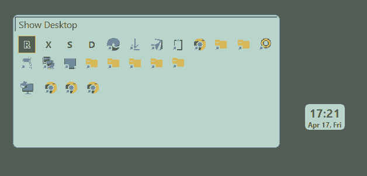

# HGFloater

HGFloater is a lightweight, high-performance utility designed for **Windows 11 and above**. It leverages translucent floating boxes and optimized keyboard/mouse interactions to enable fast and responsive computer operation. Built using pure C and WinAPI, it operates with zero external dependencies, ensuring an extremely fluid user experience.

---

## 🚀 Download and Run / 다운로드 및 실행

### English
1. **Download**: Get the latest `hgfloater.exe` from the [Releases](https://github.com/rubidus-api/hgfloater/releases/tag/v26.04.17-beta) page.
2. **Execute**: Just run `hgfloater.exe`.
3. **Shortcuts**: To add your own shortcuts to the TaskBox, place `.lnk` or `.url` files in `%USERPROFILE%\.HellGates\HGFloater\shortcuts`.
4. **Hotkey**: Press `Win + Alt + Space` (Default) to summon the TaskBox.

### 한국어
1. **다운로드**: [Releases](https://github.com/rubidus-api/hgfloater/releases/tag/v26.04.17-beta) 페이지에서 최신 `hgfloater.exe` 파일을 다운로드하세요.
2. **실행**: 다운로드한 `hgfloater.exe`를 실행하기만 하면 됩니다.
3. **단축 아이콘 추가**: 나만의 단축 아이콘을 태스크 박스에 추가하려면 `%USERPROFILE%\.HellGates\HGFloater\shortcuts` 폴더에 바로가기(`.lnk`)나 웹 링크(`.url`) 파일을 넣으세요.
4. **단축키**: `Win + Alt + Space` (기본값)를 눌러 태스크 박스를 불러낼 수 있습니다.

---

## 📖 Table of Contents / 목차
- [English Version](#hgfloater-manual-en)
- [한국어 버전](#hgfloater-manual-kr)

---

# HGFloater Manual

## 1. Purpose and Intent
The primary goal of HGFloater is to provide a streamlined, highly customizable environment for efficient system control. Currently, it functions as a **Quick Launcher** (via shortcuts) and a **Task Switcher**, allowing users to position control interfaces anywhere on the screen and manipulate them instantly.

While it complements the default Windows Taskbar, HGFloater is built for power users who demand maximum speed. The current version is just the beginning; future updates will introduce a wider array of features dedicated to making computer operation even more intuitive and responsive.

## 2. File and Directory Structure
HGFloater stores its data in the user's profile directory to ensure persistence without interfering with system files.

- **Base Directory**: `%USERPROFILE%\.HellGates\HGFloater`
  - This is the root folder where all application data is stored.
- **Shortcuts Directory**: `%USERPROFILE%\.HellGates\HGFloater\shortcuts`
  - Place your application shortcuts (`.lnk`) or web links (`.url`) here. They will automatically appear in the TaskBox toolbar.
- **Configuration File**: `%USERPROFILE%\.HellGates\HGFloater\config.ini.txt`
  - Stores all user preferences, window positions, and hotkey settings.

## 3. Configuration (config.ini.txt)
The configuration file uses a standard INI format. You can manually edit these values while the program is closed.

### [Floater] & [TaskBox] Sections
- **X, Y**: The screen coordinates (top-left) of the window.
- **W, H**: The width and height of the window.

### [Hotkey] Section
- **Modifiers**: Bitmask for modifier keys (e.g., `Alt=1`, `Ctrl=2`, `Shift=4`, `Win=8`). Default is `9` (Win + Alt).
- **Key**: The virtual key code for the trigger key. Default is `32` (Space).

## 4. Mouse Operations
### Floating Widget (Floater)
- **Left Click**: Toggle TaskBox visibility.
- **Left Drag**: Move the Floater window to any position on the screen.
- **Right Click**: Open context menu (Exit).
- **Alt + Mouse Wheel**: Adjust transparency of the Floater.

### TaskBox & Toolbars
- **Left Click (Icon)**: Activate the selected application or launch the shortcut.
- **Left Drag (Task Icon)**: Reorder icons within the Taskbar area (Drag & Drop).
- **Left Drag (Toolbar 'R' Button)**: Resize the TaskBox window dynamically.
- **Right Click (Task Icon)**: Close the selected application.
- **Ctrl + Mouse Wheel**: Adjust the size of icons and the window.
- **Alt + Mouse Wheel**: Adjust transparency of the TaskBox.
- **Border Drag**: Resize the TaskBox from any edge or corner.

## 5. Keyboard Shortcuts
### Global Trigger
- **`Win + Alt + Space`** (Default): Show or hide the TaskBox. (Can be customized in `config.ini.txt`)

### Navigation (Within TaskBox)
- **`Arrow Keys` / `HJKL` / `WASD`**: Move focus between icons.
- **`Enter` / `Space`**: Switch to the selected application or launch the shortcut.
- **`Esc`**: Hide the TaskBox.

### Window Manipulation (Works on focused window: Floater or TaskBox)
- **Movement**: `Ctrl` + `Arrow Keys` / `HJKL` / `WASD`
- **Resizing**: `Alt` + `Arrow Keys` / `HJKL` / `WASD` (or `Ctrl` + `+/-`)
- **Transparency**: `Alt` + `+` (Increase) / `-` (Decrease)

### System Actions
- **`Ctrl + Q`**: Exit HGFloater.

## 6. Build Instructions
This project is developed and tested using the **MSYS2** environment.
1. Download and install **MSYS2** from the official website: [https://www.msys2.org/](https://www.msys2.org/)
2. Open the **MSYS2 MinGW64** terminal and install the GCC toolchain by running:
   `pacman -S mingw-w64-x86_64-gcc`
3. Add the MSYS2 MinGW64 binary path (usually `C:\msys64\mingw64\bin`) to your system's **PATH** environment variable.
4. Navigate to the project directory in the MSYS2 terminal and run `build.bat`.
   - **Example**: If your project is in `D:\mydata\hgfloater`, type:
     `cd /d/mydata/hgfloater`
   - Then run the build script:
     `./build.bat` (or `cmd /c build.bat`)

## 7. About the Developer
- **Author**: rubidus (rubidus@gmail.com)
- **Development Method**: This application was developed using **Vibe Coding** with AI assistance.
- **Note**: The developer is a hobbyist coder, not a seasoned professional. This project is a result of creative experimentation and AI-driven collaboration.

## 8. The "HellGates" Series
The name "HellGates" is a playful parody of Bill Gates and Windows. It represents a collection of utilities designed to enhance the desktop experience and system responsiveness. The series was born from a desire for Windows to be a more user-friendly, lightweight, and responsive OS. Through this series, we plan to experiment with various innovative UX/UI ideas to push the boundaries of desktop interaction.

---

# HGFloater 매뉴얼 (Korean Version)

HGFloater는 **윈도우 11 이상**의 플랫폼에서 반투명 플로팅 박스와 최적화된 키보드/마우스 인터랙션을 통해 컴퓨터를 빠르고 반응성 있게 조작하기 위해 제작되었습니다. 순수 C와 WinAPI만을 사용하여 외부 의존성 없이 제작되었으며, 극도로 가볍고 즉각적인 반응성을 보장합니다.

## 1. 목적 및 의도
HGFloater의 핵심 목표는 시스템 조작의 효율성을 극대화하는 것입니다. 현재는 단축 아이콘을 이용한 **퀵 런처**와 **태스크 스위처** 기능을 중심으로, 화면 어디에나 배치하고 단축키로 즉시 제어할 수 있는 유연한 환경을 제공합니다.

기본 윈도우 태스크바를 보완하는 동시에, 속도와 효율을 중시하는 파워 유저들을 위한 강력한 도구로 설계되었습니다. 현재의 기능은 시작에 불과하며, 차후에는 컴퓨터의 빠르고 반응성 있는 조작을 돕는 다양한 기능들을 지속적으로 추가하여 완성된 조작 환경을 구축할 예정입니다.

## 2. 파일 및 디렉토리 구조
HGFloater는 설정의 영속성을 유지하기 위해 사용자 프로필 디렉토리 내에 데이터를 저장합니다.

- **기본 설정 폴더**: `%USERPROFILE%\.HellGates\HGFloater`
  - 모든 애플리케이션 데이터가 저장되는 루트 폴더입니다.
- **단축 아이콘 디렉토리**: `%USERPROFILE%\.HellGates\HGFloater\shortcuts`
  - 이 폴더에 실행 파일의 바로가기(`.lnk`)나 웹 링크(`.url`)를 넣으면 태스크 박스 툴바에 자동으로 나타납니다.
- **설정 파일**: `%USERPROFILE%\.HellGates\HGFloater\config.ini.txt`
  - 사용자 환경 설정, 창 위치, 단축키 설정 등이 저장됩니다.

## 3. 설정 항목 안내 (config.ini.txt)
설정 파일은 표준 INI 형식을 따릅니다. 프로그램을 종료한 상태에서 메모장 등으로 직접 수정할 수 있습니다.

### [Floater] 및 [TaskBox] 섹션
- **X, Y**: 창의 화면 시작 좌표(좌측 상단)입니다.
- **W, H**: 창의 가로 및 세로 크기입니다.

### [Hotkey] 섹션
- **Modifiers**: 조합 키의 비트마스크 값입니다 (예: `Alt=1`, `Ctrl=2`, `Shift=4`, `Win=8`). 기본값은 `9` (Win + Alt)입니다.
- **Key**: 호출 단축키의 가상 키 코드(Virtual Key Code)입니다. 기본값은 `32` (Space)입니다.

## 4. 마우스 조작 안내
### 플로팅 위젯 (Floater)
- **왼쪽 클릭**: 태스크 박스 보이기/숨기기 토글.
- **왼쪽 드래그**: 위젯 창을 화면 원하는 곳으로 이동.
- **오른쪽 클릭**: 컨텍스트 메뉴 (프로그램 종료).
- **Alt + 마우스 휠**: 위젯의 투명도 조절.

### 태스크 박스 및 툴바
- **아이콘 왼쪽 클릭**: 해당 앱으로 전환하거나 바로가기 실행.
- **태스크 아이콘 왼쪽 드래그**: 아이콘 순서 변경 (Drag & Drop).
- **툴바 'R' 버튼 왼쪽 드래그**: 태스크 박스 창 크기를 마우스 움직임에 따라 실시간 조절.
- **태스크 아이콘 오른쪽 클릭**: 해당 앱 종료.
- **Ctrl + 마우스 휠**: 아이콘 및 창의 전체적인 크기 조절.
- **Alt + 마우스 휠**: 태스크 박스의 투명도 조절.
- **테두리 드래그**: 창의 각 모서리나 변을 드래그하여 크기 조절.

## 5. 단축키 안내
### 전역 호출
- **`Win + Alt + Space`** (기본값): 태스크 박스 보이기/숨기기. (`config.ini.txt`에서 변경 가능)

### 탐색 (태스크 박스 내부)
- **`방향키` / `HJKL` / `WASD`**: 아이콘 사이 포커스 이동.
- **`Enter` / `Space`**: 선택한 앱으로 전환하거나 바로가기 실행.
- **`Esc`**: 태스크 박스 숨기기.

### 창 조작 (포커스된 창: 플로팅 위젯 또는 태스크 박스)
- **위치 이동**: `Ctrl` + `방향키` / `HJKL` / `WASD`
- **크기 조절**: `Alt` + `방향키` / `HJKL` / `WASD` (또는 `Ctrl` + `+/-`)
- **투명도 조절**: `Alt` + `+` (진하게) / `-` (투명하게)

### 시스템 동작
- **`Ctrl + Q`**: HGFloater 프로그램 종료.

## 6. 빌드 도움말
본 프로젝트는 **MSYS2** 환경을 기준으로 작성 및 테스트되었습니다.
1. **MSYS2** 공식 사이트([https://www.msys2.org/](https://www.msys2.org/))에서 설치 프로그램을 다운로드하여 설치합니다.
2. **MSYS2 MinGW64** 터미널을 열고 다음 명령어를 입력하여 GCC 툴체인을 설치합니다:
   `pacman -S mingw-w64-x86_64-gcc`
3. MSYS2의 MinGW64 바이너리 경로(기본값: `C:\msys64\mingw64\bin`)를 시스템 환경 변수 **PATH**에 추가합니다.
4. MSYS2 터미널에서 프로젝트 폴더로 이동한 뒤 `build.bat`를 실행합니다.
   - **이동 예시**: 프로젝트가 `D:\mydata\hgfloater` 폴더에 있다면 다음과 같이 입력합니다:
     `cd /d/mydata/hgfloater` (MSYS2에서는 드라이브 문자를 `/d/`와 같이 표시합니다.)
   - **실행**: 폴더 이동 후 다음 명령어로 빌드 스크립트를 실행합니다:
     `./build.bat` (또는 `cmd /c build.bat`)

## 7. 제작자 정보
- **제작자**: rubidus (rubidus@gmail.com)
- **제작 방식**: 이 프로그램은 AI의 도움을 받은 **바이브 코딩(Vibe Coding)**을 통해 제작되었습니다.
- **참고**: 제작자는 전문적인 경력이 많은 프로그래머가 아닌 취미로 코딩을 즐기는 사람입니다. 이 프로젝트는 창의적인 실험과 AI와의 협업을 통해 만들어진 결과물입니다.

## 8. "HellGates" 시리즈란?
"HellGates"라는 이름은 빌 게이츠(Bill Gates)와 윈도우(Windows)에 대한 유머러스한 패러디를 담고 있습니다. 이는 데스크톱 사용 경험과 반응성을 개선하기 위한 일련의 프로그램 집합을 의미합니다. MS의 윈도우 OS가 사용자 입장에서 더 편리하고, 가볍고, 반응이 빠른 운영체제가 되기를 바라는 마음에서 시작되었습니다. 이 시리즈를 통해 UX/UI에 대한 다양한 실험적인 아이디어들을 적용해 나갈 예정입니다.
