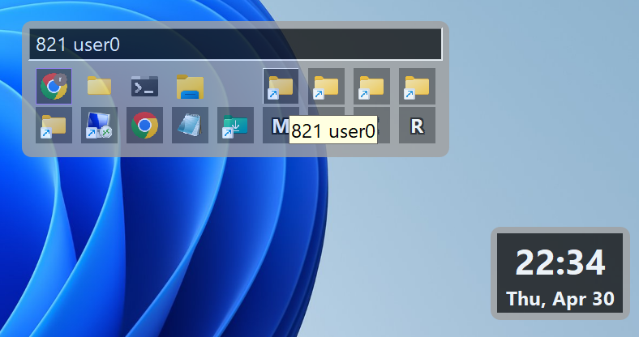

# hgfloater

**English** | [한국어](README.ko.md)

hgfloater is a lightweight desktop utility for **Windows 11 and above**. A small
translucent widget floats on your desktop; hovering it opens a dashboard that
launches your shortcuts, switches between running windows, and puts volume,
brightness, opacity, and a command console one click away. It is written in pure
C against the Win32 API with zero external dependencies, so it starts instantly
and stays out of your way.

<!-- SKIP_START -->

<!-- SKIP_END -->

---

## Table of Contents

1. [Overview](#1-overview)
2. [Install and First Run](#2-install-and-first-run)
3. [The Two Windows](#3-the-two-windows)
4. [The Floater](#4-the-floater)
5. [The Taskbox](#5-the-taskbox)
6. [The Toolbar](#6-the-toolbar)
7. [The Options Menu](#7-the-options-menu)
8. [The Command Box](#8-the-command-box)
9. [Monitor Thumbnails](#9-monitor-thumbnails)
10. [Keyboard Reference](#10-keyboard-reference)
11. [Mouse Reference](#11-mouse-reference)
12. [Configuration File](#12-configuration-file)
13. [Files and Directories](#13-files-and-directories)
14. [Building From Source](#14-building-from-source)
15. [Project Layout](#15-project-layout)
16. [Tests and Verification](#16-tests-and-verification)
17. [About the Developer](#17-about-the-developer)
18. [The HellGates Series](#18-the-hellgates-series)
19. [License](#19-license)

---

## 1. Overview

hgfloater aims at one thing: making everyday desktop control faster than the
stock taskbar allows. It currently works as a **quick launcher**, a **task
switcher**, and a **system control panel** (volume, brightness, window opacity,
screen lock), all reachable from a widget you can park anywhere on any monitor.

Design principles worth knowing before you use it:

- **Nothing runs in the background but the app itself.** No services, no
  installers, no registry keys. A single `hgfloater.exe`.
- **One file on disk.** Settings live in a plain `config.ini` under your user
  profile. The program writes no logs, caches, or temporary files.
- **Everything is adjustable in place.** Size, opacity, font size, grid shape,
  and colors change live with the wheel or the keyboard, and persist by
  themselves.
- **Keyboard and mouse are equal citizens.** Every action has both a pointer
  gesture and a key.
- **It follows the system theme.** Switching Windows between light and dark mode
  re-colors the widgets immediately.

## 2. Install and First Run

1. **Download** the latest `hgfloater.exe` from the
   [Releases](https://github.com/rubidus-api/hgfloater/releases/tag/v26.07.20b)
   page.
2. **Run it.** There is no installer. On first launch it creates
   `%USERPROFILE%\.HellGates\hgfloater\` with a `config.ini` and a `shortcuts`
   folder, then shows the floater.
3. **Add shortcuts.** Drop `.lnk` or `.url` files into
   `%USERPROFILE%\.HellGates\hgfloater\shortcuts`. They appear in the taskbox
   automatically; press `Esc` in the taskbox to re-scan the folder immediately.
4. **Summon it from anywhere** with `Win + Alt + Space` (configurable).

Only one instance runs at a time. Launching `hgfloater.exe` again simply
signals the running copy instead of starting a second one.

## 3. The Two Windows

hgfloater is built from two windows that trade places:

| Window | What it is | How you get it |
| :--- | :--- | :--- |
| **floater** | A small always-on-top widget: clock, date, host name, and system bars. | The default state. |
| **taskbox** | The dashboard: running windows, your shortcuts, and the toolbar. | Hover or click the floater, or press the global hotkey. |

Expanding centers the taskbox on the floater and then pushes it fully inside
that monitor's work area, so a floater parked at a screen edge never yields a
clipped dashboard. Collapsing returns the floater to where it was — and if you
moved the taskbox while it was open, the floater travels the same distance, so
the pair stays where you left it.

## 4. The Floater

The floater is the resting state: a compact translucent panel that stays on top
of other windows.

**What it shows**

- **Clock and date**, refreshed every second, sized proportionally to the
  widget itself.
- **Host name** in a thin line across the top.
- **Status bars** for CPU, memory, and battery: horizontal bars (red, blue,
  green) running the full width behind the text, with small labels on the left
  edge. Full width means 100%. The battery row hides itself on desktops without
  one, and a `+` on its label means charging. Set `show_stats=0` in `config.ini`
  to hide the whole line.

**What you can do to it**

- **Hover** — opens the taskbox in place. The floater hides itself while the
  taskbox is up.
- **Left click** — toggles the taskbox.
- **Left drag** — moves the floater anywhere on any monitor.
- **Alt + Wheel** — opacity.
- **Ctrl + Wheel** or **Ctrl + Left drag** — font size, which scales the whole
  widget with it.
- **Alt + Arrows / WASD** — moves the window from the keyboard.
- **`T`** — opens the taskbox. **`C`** — opens the Command Box. **`F1`** — About.

When the cursor leaves the taskbox, it collapses back to the floater after a
half-second grace period, so brushing past the edge does not dismiss it.

## 5. The Taskbox

The taskbox is a grid of icons with a status line on top and a toolbar of
built-in buttons.

### 5.1 Running windows and shortcuts

- **Task icons** come first: one per visible top-level window, in the order
  Windows reports them.
- **Shortcut icons** follow: one per `.lnk` or `.url` in your shortcuts folder.
- **Left click** activates a task or launches a shortcut.
- **Left drag** on a task icon reorders it within the grid.
- **Right click** (or `Enter` / `F2` on the focused icon) opens its menu:
  - **Run (&R)** — start a new instance, or launch the shortcut.
  - **Focus (&F)** — switch to the existing window.
  - **Close Window (&X)** — task icons only.
  - **Open File Location (&O)** — shortcut icons only.

### 5.2 The status line

A single-line read-only field across the top of the taskbox.

- It shows **one message at a time** — the most recent one replaces its
  predecessor.
- Ten seconds after the last message it falls back to the **current time**,
  written as `2026. 11. 23.(Tue) 13:24`, and refreshes as the minute changes.
- **Right click** it to open the options menu (the same one the `O` button
  shows).
- **Left drag** it to move the whole taskbox.
- **Ctrl + Wheel** over it changes only its own font size.

### 5.3 Shape and size

- **Drag any border** to change the grid: the taskbox snaps to whole columns, so
  no half icon is ever left hanging.
- **Ctrl + Wheel** (or `Ctrl` + `+` / `-`) scales icons and text together and
  keeps the window proportional.
- **Alt + Wheel** (or `Alt` + `+` / `-`) changes opacity.
- **`Ctrl` + `R` / `0`, or `F5`** resets position, size, and opacity.

## 6. The Toolbar

Eleven built-in buttons sit in the same grid as the icons. Their order is fixed.

| Button | Click | Drag / Wheel |
| :--- | :--- | :--- |
| **`R`** Resize | — | **Drag** resizes the taskbox grid. |
| **`M`** Move | **Click** moves the taskbox aside (see below). | **Drag** moves the window. |
| **`X`** Exit | Quits hgfloater. | — |
| **`D`** Desktop | Minimizes every window; click again to restore. | — |
| **`O`** Options | Opens the [options menu](#7-the-options-menu). | — |
| **`C`** Command | Opens the [Command Box](#8-the-command-box). | — |
| **`A`** Alpha | — | **Wheel** changes taskbox opacity. The red background brightens as opacity rises. |
| **`B`** Brightness | — | **Wheel** changes screen brightness in 5% steps. The green background brightens with it. |
| **`V`** Volume | Toggles mute. A thick accent border marks the muted state. | **Wheel** changes the volume. The blue background brightens with it. |
| **`F`** Floater | Collapses to the floater for tuning (see below). | — |
| **`P`** Pin | Pins the taskbox open. | — |

**`M` — move aside.** Clicking the move handle without dragging nudges the pair
out of the way on its own, just far enough to stop covering the spot it was
sitting on. Clicks keep their heading, so pressing it repeatedly walks the
window across the screen; when that heading runs out of room it turns
counter-clockwise — north, west, south, east, and back to north. If no direction
has room, nothing moves.

**`B` — brightness.** Laptop panels and external monitors are both supported:
hgfloater asks the monitor over DDC/CI first and falls back to a gamma ramp when
the hardware refuses.

**`F` — floater adjust.** Collapses the dashboard and suspends hover-to-expand,
so you can tune the floater with `Ctrl + Wheel` (size) and `Alt + Wheel`
(opacity) without the taskbox reappearing under your cursor. Click the floater
to go back.

**`P` — pin.** While pinned, moving the mouse away no longer collapses the
taskbox, and the button carries an accent border. Explicit closes — `X`, `Esc`,
the global hotkey, a floater click — still work. Click again to unpin.

## 7. The Options Menu

Open it with the `O` toolbar button or by right-clicking the status line.

- **Open Shortcuts Folder** — opens the shortcuts directory in Explorer.
- **Edit Configuration** — opens `config.ini` in Notepad.
- **About...** — this document, rendered inside the app.
- **Reset Settings** — restores default geometry, opacity, sizes, and colors.
- **Select Audio Device** — lists the output devices with the current one
  checked, and offers a **Mute** toggle.
- **Arrange Monitors** — turns the [monitor thumbnails](#9-monitor-thumbnails)
  on and off.
- **Lock Screen (Power Off)** — locks the workstation.
- **Exit** — quits.

## 8. The Command Box

A standalone console window, opened with the `C` toolbar button or the `C` key
while the floater or taskbox has focus.

- Type a command and run it with **`Ctrl + Enter`** or the Execute button.
- **`Ctrl + Space`** returns focus to the input field.
- The window keeps its own position, size, opacity, font, and font size in
  `config.ini`, independent of the other widgets.

## 9. Monitor Thumbnails

**Arrange Monitors** in the options menu opens a live thumbnail window per
connected display.

- **Click and drag inside a thumbnail** to drive the real monitor: mouse input
  is forwarded to it, so you can operate a screen you are not looking at.
- **Left drag the thumbnail's edit box** to move the thumbnail window.
- **Right click the edit box** to close it.
- Each thumbnail remembers its own position and size.

## 10. Keyboard Reference

### Global

| Key | Action |
| :--- | :--- |
| `Win + Alt + Space` | Show or hide the taskbox (configurable). If a window has drifted off screen, it is pulled back into the nearest monitor's work area. |

### Inside the taskbox

| Key | Action |
| :--- | :--- |
| `Arrow keys` / `WASD` | Move focus between icons |
| `Space` | Activate the focused item |
| `Enter` / `F2` | Open the focused item's context menu |
| `C` | Open the Command Box |
| `Esc` | Hide the taskbox and re-scan shortcuts |

### Window manipulation (focused or hovered floater/taskbox)

| Key | Action |
| :--- | :--- |
| `Alt` + `Arrow keys` / `WASD` | Move the window |
| `Ctrl` + `+` / `-` | Font and icon size |
| `Alt` + `+` / `-` | Opacity |
| `Ctrl` + `R` / `0`, `F5` | Reset position, size, and opacity |

### System

| Key | Action |
| :--- | :--- |
| `F1` | About |
| `T` | Open the taskbox (from the floater) |
| `Ctrl` + `Q` / `X`, `Alt + F4` | Quit |
| `Ctrl + Enter` | Execute (inside the Command Box) |
| `Ctrl + Space` | Focus the input (inside the Command Box) |

## 11. Mouse Reference

| Action | Gesture |
| :--- | :--- |
| **Show / hide the taskbox** | Hover or left-click the floater, or press the global hotkey |
| **Activate an item** | Left-click an icon |
| **Reorder icons** | Left-drag a task icon |
| **Item context menu** | Right-click an icon |
| **Options menu** | Left-click `O`, or right-click the status line |
| **Move a window** | Left-drag empty space, the status line, or the `M` button |
| **Move the taskbox aside** | Left-click the `M` button |
| **Resize the taskbox grid** | Drag a border, or drag the `R` button |
| **Font / icon size** | `Ctrl` + wheel |
| **Opacity** | `Alt` + wheel, or wheel over `A` |
| **Screen brightness** | Wheel over `B` |
| **Volume / mute** | Wheel over `V` / click `V` |
| **Pin the taskbox** | Left-click `P` |
| **Remote monitor control** | Click or drag inside a monitor thumbnail |
| **Quit** | Left-click `X`, or Exit in the options menu |

## 12. Configuration File

`%USERPROFILE%\.HellGates\hgfloater\config.ini`, plain INI, safe to edit by hand
while the program is closed. Missing keys are written back with their defaults on
startup, so deleting a key restores it.

Settings that change in bursts — opacity, font and icon size, window position —
are written once the change settles (about a second) or at exit, rather than on
every wheel notch.

### `[floater]` and `[taskbox]`

| Key | Meaning |
| :--- | :--- |
| `x`, `y` | Top-left screen coordinates |
| `w`, `h` | Width and height |
| `alpha` | Opacity, 76–255 |
| `font_size` | Text size |
| `icon_size` | Icon resolution (`[taskbox]` only) |
| `show_stats` | `0` hides the CPU/memory/battery line (`[floater]` only, default `1`) |

### `[commandbox]`

Its own `x`, `y`, `w`, `h`, `alpha`, `font_size`, and `font_name`.

### `[etc]`

| Key | Meaning |
| :--- | :--- |
| `font_name` | Font for edit controls, tooltips, and the About dialog (default `Segoe UI`) |

### `[colors]`

Every accent color as `RRGGBB` hex, for example `FFD228`:

- `scheme_bg`, `scheme_border`, `scheme_text`, `scheme_flash`, `scheme_selected`
  — the dark palette.
- `focus_bg` — the keyboard/mouse focus highlight.
- `stat_cpu`, `stat_mem`, `stat_bat` — the floater's status bars.
- `value_alpha_low` / `value_alpha_high`, `value_brightness_low` /
  `value_brightness_high`, `value_volume_low` / `value_volume_high` — the
  gradients behind the `A`, `B`, and `V` buttons.

### `[hotkeys]`

| Key | Meaning |
| :--- | :--- |
| `global_focus_modifiers` | Modifier bitmask: `Alt=1`, `Ctrl=2`, `Shift=4`, `Win=8`. Default `9` (Win + Alt) |
| `global_focus_key` | Virtual key code of the trigger. Default `32` (Space) |

## 13. Files and Directories

| Path | Purpose |
| :--- | :--- |
| `%USERPROFILE%\.HellGates\hgfloater\` | Base directory, created on first run |
| `%USERPROFILE%\.HellGates\hgfloater\config.ini` | Every setting |
| `%USERPROFILE%\.HellGates\hgfloater\shortcuts\` | Your `.lnk` and `.url` files |

That is the complete list. hgfloater writes no log files, no caches, and no
temporary files, and nothing it writes grows without bound.

<!-- SKIP_START -->
## 14. Building From Source

The project builds with **MinGW-w64 GCC** and nothing else — no libraries, no
build system beyond `make` (or the batch script). The build is expected to stay
warning-clean under a strict warning set.

### 14.1 Toolchain

On Windows, install [MSYS2](https://www.msys2.org/), then:

```sh
pacman -S mingw-w64-x86_64-gcc make
```

Add `C:\msys64\mingw64\bin` to your `PATH` so `gcc` and `windres` are visible.

On Linux or macOS you need a mingw-w64 cross toolchain (`x86_64-w64-mingw32-gcc`
and `x86_64-w64-mingw32-windres`) plus GNU `make`.

### 14.2 With make

```sh
make                      # release build -> hgfloater.exe
make debug                # unoptimised build with symbols
make test                 # build and run the tests
make clean
```

Useful variables:

| Variable | Effect |
| :--- | :--- |
| `CROSS=x86_64-w64-mingw32-` | Build with a cross toolchain from Linux/macOS |
| `OUT=build` | Write the executable and objects to another directory |
| `VERSION_SUFFIX=b` | Mark a same-day re-release, e.g. `v26.07.20b` |

For example, a cross build into `build/`:

```sh
make CROSS=x86_64-w64-mingw32- OUT=build release
```

### 14.3 With build.bat

`build.bat` offers the same builds through a menu on Windows:

```bat
build.bat            REM interactive menu
build.bat release    REM non-interactive, exits with the build result
build.bat debug
build.bat test
```

### 14.4 What the build does

- The version string is the build date, `vYY.MM.DD`, optionally suffixed.
- `scripts/gen_about.py` (or `gen_about.ps1` on Windows) regenerates
  `src/hg_about_text.h` from this README, which is what the About dialog shows.
  Never edit that header by hand — edit the README and rebuild.
- The release build is `-O3 -flto` and stripped, linked statically, so the
  resulting `hgfloater.exe` needs no runtime DLLs.
<!-- SKIP_END -->

<!-- SKIP_START -->
## 15. Project Layout

```
hgfloater/
├── Makefile              build for POSIX hosts and MSYS2
├── build.bat             interactive Windows build menu
├── README.md             this file (English, the reference version)
├── README.ko.md          Korean translation
├── CHANGELOG.md          release history
├── src/                  all source and resources
│   ├── hgfloater.c       entry point, message loop, single-instance IPC
│   ├── hg_common.h       shared macros, ids, and constants
│   ├── hg_globals.*      global state
│   ├── hg_utils.*        theme, icons, toolbar descriptors, helpers
│   ├── hg_config.*       config.ini load/save, deferred writes
│   ├── hg_calc.*         pure math: layout, placement, clock formatting
│   ├── hg_audio.c        volume and device selection
│   ├── hg_display.c      monitors, DPI, brightness
│   ├── hg_shell.c        shortcuts and shell integration
│   ├── hg_sysinfo.c      CPU, memory, battery
│   ├── hgfloater.rc      version info, icon, manifest
│   └── widgets/          one file per window
│       ├── hg_floater.c
│       ├── hg_taskbox.c, hg_taskbox_menus.c, hg_toolbar.c, hg_window_list.c
│       ├── hg_commandbox.c
│       ├── hg_monitor.c
│       └── hg_about.c
├── test/                 console tests
├── scripts/              build and documentation helpers
└── docs/                 design notes and the test catalogue
```

`hg_calc.c` deliberately depends on neither Win32 nor the C runtime, so the
logic that is easy to get wrong — grid snapping, where a window moves to, how
the clock reads — can be tested on any host.
<!-- SKIP_END -->

<!-- SKIP_START -->
## 16. Tests and Verification

```sh
make test                     # compile every test, run the host-native ones
sh scripts/build-mingw.sh     # full cross-build verification
sh scripts/project-check.sh   # documentation and repository hygiene
```

Every file in `test/` is compiled with the full warning set. The units that
avoid Win32 also run natively on the build host, so their behaviour — not just
their compilation — is checked without a Windows machine. `docs/tests/` holds the
catalogue of what each check covers.
<!-- SKIP_END -->

## 17. About the Developer

- **Author**: rubidus-api (rubidus@gmail.com)
- **Method**: developed with AI assistance, in the "vibe coding" style.
- **Note**: the author is a hobbyist, not a career programmer. This project is
  the result of creative experimentation and collaboration with AI tools.

## 18. The HellGates Series

"HellGates" is a playful parody of Bill Gates and Windows: a collection of
utilities meant to make the desktop lighter and more responsive. The series
started from wishing Windows were friendlier, quicker, and less in the way, and
it exists to try UX ideas that the stock shell will not.

## 19. License

Released under the MIT License. See [LICENSE](LICENSE).
