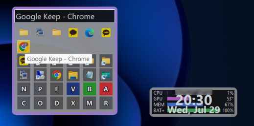

# HGFloater

**English** | [한국어](README.ko.md)

**v0.17.2** — built 2026-08-23 21:00 KST

**[Download hgfloater.exe (latest release)](https://github.com/rubidus-api/hgfloater/releases/latest/download/hgfloater.exe)** · [All releases](https://github.com/rubidus-api/hgfloater/releases)

HGFloater is a lightweight desktop utility for **Windows 11 and above**. A small
translucent widget floats on your desktop; clicking it opens a dashboard that
launches your shortcuts, switches between running windows, and puts volume,
brightness, opacity, and a command console one click away. It is written in pure
C against the Win32 API with zero external dependencies: the whole program is a
single **executable of about 600 KB** that needs no installer and no runtime, so
it starts instantly and stays out of your way.

<!-- SKIP_START -->

<!-- SKIP_END -->

---

## Table of Contents

1. [Overview](#1-overview)
2. [Install and First Run](#2-install-and-first-run)
3. [The Two Windows](#3-the-two-windows)
4. [The Floater](#4-the-floater)
5. [The Taskbox](#5-the-taskbox)
6. [The Toolbar](#6-the-toolbar)
7. [The Options Menu](#7-the-options-menu)
8. [The Command Box](#8-the-command-box)
9. [Monitor Thumbnails](#9-monitor-thumbnails)
10. [Notes](#10-notes)
11. [Keyboard Reference](#11-keyboard-reference)
12. [Mouse Reference](#12-mouse-reference)
13. [Configuration File](#13-configuration-file)
14. [Files and Directories](#14-files-and-directories)
15. [Building From Source](#15-building-from-source)
16. [Project Layout](#16-project-layout)
17. [Tests and Verification](#17-tests-and-verification)
18. [About the Developer](#18-about-the-developer)
19. [The HellGates Series](#19-the-hellgates-series)
20. [License](#20-license)

---

## 1. Overview

HGFloater aims at one thing: making everyday desktop control faster than the
stock taskbar allows. It works as a **quick launcher**, a **task switcher**, a
**system control panel** (volume, per-display brightness and scaling, window
opacity, screen lock), a **command box** for driving windows by name and number,
and a **note pad** - all reachable from a widget you can park anywhere on any
monitor.

Design principles worth knowing before you use it:

- **Nothing runs in the background but the app itself.** No services, no
  installer. A single `hgfloater.exe`. It writes exactly one registry value, and
  only if you switch **Start with Windows** on - the ordinary per-user `Run`
  entry, which you can see and delete yourself.
- **Plain files on disk, in one folder.** Settings live in a plain `config.ini`
  under your user profile, and notes are plain `.txt` files beside it. Nothing
  is a database, everything is editable by hand, and the program writes no logs,
  caches, or temporary files.
- **Everything is adjustable in place.** Size, opacity, font size, grid shape,
  and colors change live with the wheel or the keyboard, and persist by
  themselves.
- **Keyboard and mouse are equal citizens.** Every action has both a pointer
  gesture and a key.
- **The taskbox has no background of its own.** The desktop shows through
  between the icons and behind the function buttons and shortcuts; only the
  icons, their labels and the border are drawn. Each lettered function button
  keeps **one white line** around it, because a button needs an edge to be a
  button. A side effect worth knowing: clicks land on whatever is behind those
  gaps, so drag the box by its `M` button rather than by the space between
  icons.
- **It follows the system theme.** Switching Windows between light and dark mode
  re-colors everything immediately. The **widgets** invert it on purpose - a
  control has to stand out against the desktop behind it - while the **document
  windows** (notes, note list, clipboard history, command box, About) follow it
  directly: light grey page with black text on a light theme, black page with
  white text on a dark one. Under high contrast both defer to the colors you
  chose there.

## 2. Install and First Run

1. **Download** the latest `hgfloater.exe` from the
   [Releases](https://github.com/rubidus-api/hgfloater/releases/tag/v0.17.2)
   page.
2. **Run it.** There is no installer. On first launch it creates
   `%USERPROFILE%\.HellGates\hgfloater\` with a `config.ini` and a `shortcuts`
   folder, then shows the floater.
3. **Add shortcuts.** Drop `.lnk` or `.url` files into
   `%USERPROFILE%\.HellGates\hgfloater\shortcuts`. They appear in the taskbox
   automatically; press `Esc` in the taskbox to re-scan the folder immediately.
   A shortcut that points at a **folder** goes to the
   [`Dir` button's list](#61-the-dir-button) rather than the icon grid.
4. **Summon it from anywhere** with `Win + Alt + Space` (configurable).

Only one instance runs at a time. Launching `hgfloater.exe` again simply
signals the running copy instead of starting a second one.

### Checking what you downloaded

The executable is unsigned, so nothing but the file itself vouches for it. Three
ways to check, none of which require taking anyone's word:

- **Verify the file.** Every release lists the **SHA-256** of the download.
  In PowerShell: `Get-FileHash .\hgfloater.exe -Algorithm SHA256`. If it
  matches the release notes, you have the file that was built here.
- **Try the `.zip`, when a release carries one.** Some releases also offer the
  same executable inside a zip, which browser download-protection tends to
  treat less harshly.
- **Read the source.** All of it is in this repository under the MIT licence,
  and the build is reproducible from the included `Makefile` / `build.bat`.

One thing the binary demonstrably cannot do: **reach the network**. It imports
no socket, HTTP, or download function of any kind, so it cannot phone home,
fetch anything, or send anything anywhere.

Two features are **switched off in the published builds** until the executable
is code-signed — the [maximize-button menu](#41-the-maximize-button-menu), which
needs a system-wide mouse hook, and **Start with Windows**, which writes one
value under the per-user `Run` key. Both stay in the options menu, greyed, reading
`(off in this build)`.

## 3. The Two Windows

HGFloater is built from two windows that trade places:

| Window | What it is | How you get it |
| :--- | :--- | :--- |
| **floater** | A small always-on-top widget: clock, date, host name, and system bars. | The default state. |
| **taskbox** | The dashboard: running windows, your shortcuts, and the toolbar. | Click the floater, or press the global hotkey. |

Expanding centers the taskbox on the floater and then pushes it fully inside
that monitor's work area, so a floater parked at a screen edge never yields a
clipped dashboard. Collapsing returns the floater to where it was — and if you
moved the taskbox while it was open, the floater travels the same distance, so
the pair stays where you left it.

## 4. The Floater

The floater is the resting state: a compact translucent panel that stays on top
of other windows.

**What it shows**

- **Clock and date**, refreshed every second, sized proportionally to the
  widget itself.
- **Host name** in a thin line across the top.
- **Status bars** for CPU, temperature, GPU, memory, and battery: horizontal
  bars running behind everything - the host name included - with small labels
  down the left edge and each row's **reading printed down the right**. Full
  width means 100%; the two temperature rows use their own scale, below. A row
  whose value the machine does not report is absent entirely, which is why
  desktops have no battery row and machines without sensors have no `TMP` or
  `GPU`. Set `show_stats=0` in `config.ini` to hide the whole panel.
- **`TMP`** is drawn on a fixed **20 to 100 degree Celsius** scale rather than as
  a percentage, with the reading printed on its own bar, because the difference
  between 55 and 75 degrees matters more than a few pixels of bar length can
  say.

  **`GPU`** follows it on the same scale, and it gets a better answer than the
  CPU does: the adapter's own sensor, read through the same interface Task
  Manager uses, with no vendor SDK and no driver. Plenty of drivers report
  nothing, and those machines simply have no GPU row.

  The CPU reading is read from an **ACPI thermal zone** your firmware exposes. That is the
  only temperature reachable without installing a kernel driver and running as
  administrator, and it is worth knowing what it is: **a sensor on the board
  near the CPU, not the CPU die**. It tracks the processor without being it, and
  it lags under a sudden load. Many machines expose no zone at all - on those
  the row simply is not there, the same way the battery row is absent on a
  desktop. If you need true per-core readings, use a tool built around a
  hardware-monitoring driver; HGFloater will not become one.

  Firmware usually declares **several** zones, and often puts one it never
  updates in front of the live one, so a single reading taken blindly is a coin
  toss. HGFloater reads **every** zone, from both surfaces Windows offers - the
  WMI class and the thermal performance counters, which do not always agree
  about being available - and prefers a zone it has watched change over one that
  has only ever held the same number. Type **`list sensors`** in the command box
  to see all of them and which one is on the bar.

**What you can do to it**

- **Left click** — toggles the taskbox, from anywhere on the floater. It opens
  in place, and the floater hides itself while the taskbox is up.
- **Hover** — nothing, unless **Open the Taskbox on Hover** is switched on in
  the [Options menu](#7-the-options-menu). With it on, resting the pointer on
  **the clock's minutes** — the two digits after the colon, and nothing else on
  the floater — opens the taskbox. The click above keeps working from anywhere
  either way.
- **Left drag** — moves the floater anywhere on any monitor. A press and
  release without moving is a click and toggles the taskbox; a few pixels of
  travel makes it a drag instead. `Alt + drag` does the same and is the one to
  use with **Open the Taskbox on Hover** switched on, since the dashboard opens
  under the pointer before an ordinary drag can start.
- **Alt + Wheel** — opacity.
- **Ctrl + Wheel** or **Ctrl + Left drag** — font size, which scales the whole
  widget with it.
- **Alt + Arrows / WASD** — moves the window from the keyboard.
- **`T`** — opens the taskbox. **`C`** or **`Ctrl + E`** — opens the Command
  Box. **`F1`** — About.

When the cursor leaves the taskbox, it collapses back to the floater after a
half-second grace period, so brushing past the edge does not dismiss it.

### 4.1 The maximize button menu

While HGFloater is running, **right-click the maximize button** — the one left
of the X — on **any** window, and you get HGFloater's menu for that window:
**Move to (0, 0)**, the same size presets the task icons offer, and **Close**,
which shuts the menu without touching the window. Left-clicking the button still
maximizes; right-clicking a caption button does nothing in Windows, so nothing
was taken away.

It works on HGFloater's own document windows too — a note, the note list, the
command box, the About window — and on any window whose title bar answers
hit-tests its own way (a PuTTY-style utility): where the window declines to
name its buttons, the DWM-computed button bounds say which third the click
landed on.

Switch it off with **Menu on Maximize Button** in the options menu, or
`caption_menu=0` under `[etc]`. **Close HGFloater and the behaviour is gone** —
there is nothing installed and nothing to uninstall.

Three cases where the click does what it always did, none of them a failure:

- **Windows running as administrator.** Windows does not let an unelevated
  program touch input bound for an elevated one, and HGFloater runs unelevated
  on purpose.
- **Windows with no maximize button** — nothing to right-click.
- **Applications that report neither a maximize button nor caption-button
  bounds.** Rare, and they simply keep their ordinary behaviour.

This is the only thing HGFloater does outside its own windows, and it needs a
system-wide mouse hook to do it. The hook reads the button and the coordinates
and nothing else; it holds no keyboard hook and never has. The design and its
costs are in `docs/RFC-2026-07-caption-button-menu.md`.

## 5. The Taskbox

The taskbox is a grid of icons with a status line on top and a toolbar of
built-in buttons.

### 5.1 Running windows and shortcuts

- **Task icons** come first: **one per window, not one per program**, in the
  order Windows reports them. A program with four windows open gets four icons,
  each going straight to its own window.

  That now includes **HGFloater's own windows** — every open note editor, the
  note list, the clipboard history, the command box. All of them are **ordinary
  application windows**: each gets its own taskbar button, its own Alt-Tab
  entry, and all three caption buttons — minimize, maximize, close — and they
  stay open regardless of what the floater and taskbox do, until you
  close them. The floater, the taskbox and the toolbar stay out: they are the
  thing you are looking at.
- **Shortcut icons** follow: one per `.lnk` or `.url` in your shortcuts folder.

> ### 📌 How to add a shortcut icon
>
> 1. **Open the options menu** — the `Opt` button, `Ctrl + O`, or a right-click
>    on the status line.
> 2. Choose **Open Shortcuts Folder**. Explorer opens on
>    `%USERPROFILE%\.HellGates\hgfloater\shortcuts\`.
> 3. **Copy a shortcut into it** — any `.lnk` or `.url`. Drag one out of the
>    Start menu, or right-click a program and *Send to → Desktop*, then move
>    that file here.
>
> The new icon appears within a second. No restart, no settings screen: the
> folder **is** the setting.
>
> **To change the order, rename the files.** Icons are sorted by file name, so
> putting a number in front controls where each one sits:
>
> ```
> 0001 Visual Studio Code.lnk
> 0002 Firefox.lnk
> 0010 Calculator.lnk
> ```
>
> Pad the numbers to the same width — `0001`, not `1`. The sort is a plain
> alphabetical one, so `10` would come before `2` otherwise. Leaving gaps
> (`0010`, `0020`, `0030`) means you can slip something in later without
> renaming everything after it.
- **Left click** activates a task or launches a shortcut.

**Every task icon carries a label** in its top-left corner — `0` to `9`, then
`A` to `Z`. **`Shift` + that character** activates the icon, exactly as clicking
it would. Digits come first because the first ten windows are the ones you reach
most, and a digit is one keystroke to find. Past 36 icons there is no label and
no key. `Shift` is what keeps this clear of the bare-letter grid movement
(`WASD`) and of the bare `C` that opens the command box.

**Hover a tabbed application's icon and its tabs appear next to it.** Off by
default; turn it on with **Show Tabs as Task Icons** in the options menu, or
`show_tabs=1` under `[taskbox]` in `config.ini`. The window keeps its single
icon — orderable like any other — and the hover box lists its tabs by title:

**Pointing at a task icon outlines its window on the desktop.** A frame appears
around the window itself, so "which one is that?" is answered by where it is and
not only by its name. Nothing else happens - the window is not raised, not
focused, and the outline takes no clicks, because pointing at something is not
choosing it. The keyboard focus does the same as the pointer. A **minimized**
window is left alone: there is no place on the desktop to point at, and a frame
around where it used to be would be a lie. A window sitting **behind** others is
outlined all the same - the frame says where it is, not what is in front of it.

The box opens on hover **and** when the keyboard focus lands on the icon, so
both ways of getting there work the same.

**It never covers the icon.** The box sits flush above or below it — never
beside it — running right from the icon's left edge or left from its right
edge, so the icon's whole width falls inside the box's and the two read as one
piece. Of those four placements it takes the first that fits the display whole,
which is what keeps it from running off an edge near a corner.

These keys are the box's, and they are **the same in all three lists** — the
tabs, the `Dir` folders and the `Set` controls:

| Key or click | What it does |
| :--- | :--- |
| `1`-`9` | Straight to that row, whether or not you have stepped into the box. |
| `0` | The last row, the same way. |
| `Up` / `Down` | **Step into the box**, and from then on move the selection in it. `Down` enters at the top row and `Up` at the bottom, so the selection lands where the key was already pointing. The box is what sits above or below the icon, so those keys reach it rather than stepping over it to the next row of icons. |
| `Tab` | Step into the box as well. On a `Dir` or `Set` button, `Space` does it too: activating the button opens its list **and** hands it the keyboard. |
| `Home` / `End` | The first row, the last row. The selected row is filled and marked, so where the arrows are standing is never in doubt. |
| `Left` / `Right` | Leave the box and move to the icon left or right — a list is a column, and sideways is what the grid means by those keys. The next icon opens its own box if it has one. **One exception:** on a `Set` row that holds a percentage, Left and Right are less and more. |
| `a`-`z`, `A`-`Z` | The labels past the ninth row (inside the box, because those letters move the grid outside it). |
| `Enter` / `Space`, or a click | Take that row: switch to the tab, open the folder, flip the switch. |
| A tooltip | On every `Set` row, as you arrive: which keys that row answers — the arrows for a number, `Space` or `Enter` for a switch. |
| Right click | Close that tab. The list stays up. (Tabs only.) |
| `Esc` | Leave the box. The keyboard stays in the taskbox, where it was. |

**A row too long for the box says the rest in a tooltip** — whether the pointer
found it or the arrows did. The box is measured against its own rows first and
takes the width they need, so most lists are read whole; the tooltip is for what
is longer than any box should be.

Digits work immediately because the grid does not use them; the letters wait
for `Tab` because `WASD` moves the focus and `C` and `N` open other things.

**The tabs are read when you look at them**, once per box, and never on a
timer — a window nobody hovers costs nothing at all.

Nothing about this is specific to browsers. What limits it is cost: a tab is not
a window, so the only supported way to find one is **UI Automation** — a call
into the other application's own UI thread, which is slow and can block if that
thread is busy. Asking every window on the desktop would make that cost the cost
of running HGFloater, so it asks only windows whose **class** is on a list:

| Built in | |
| :--- | :--- |
| `Chrome_WidgetWin_1` | Chrome, Edge, Brave, Opera, and Electron apps |
| `CabinetWClass` | File Explorer |
| `MozillaWindowClass` | Firefox |
| `CASCADIA_HOSTING_WINDOW_CLASS` | Windows Terminal |
| `Notepad` | Notepad |

**Any other application can be added** with `tab_classes` under `[taskbox]`,
semicolon-separated, no rebuild needed:

```ini
[taskbox]
tab_classes=SomeApp_Frame;OtherApp
```

Run **`show windows class`** (`s w class`) in the command box to see the class of
every open window, which is where those names come from. An application whose
tabs UI Automation does not publish will simply keep its single icon.

The reading happens **on a background thread**, and the box draws from what was
last known while the fresh answer is on its way — a cross-process call whose
cost grows with the browser's own accessibility data is never waited for.
Anything that fails falls back silently to one icon for the window. Some
applications do not
publish off-screen tabs at all, and those tabs will not appear. The design and
what it costs are in `docs/RFC-2026-07-tabs-as-task-icons.md`.
- **Left drag** on a task icon reorders it within the grid.
- **Right click** (or `Enter` / `F2` on the focused icon) opens its menu:
  - **Run (&R)** — start a new instance, or launch the shortcut.
  - **Focus (&F)** — switch to the existing window.
  - **Close Window (&X)** — task icons only. On a **tab** icon this reads
    **Close Tab** and closes only that tab, by invoking the tab's own close
    button; if the tab has no such button nothing is closed and the status line
    says so. **Focus** on a tab switches to that tab rather than only raising
    its window.
  - **Open File Location (&O)** — shortcut icons only.

### 5.2 The status line

A single-line read-only field across the top of the taskbox.

- It shows **one message at a time** — the most recent one replaces its
  predecessor.
- Ten seconds after the last message it falls back to the **current time**,
  written as `2026. 11. 23.(Tue) 13:24`, and refreshes as the minute changes.
- **Right click** it to open the options menu (the same one the `Opt` button
  opens).
- **Left drag** it to move the whole taskbox.
- **Ctrl + Wheel** over it changes only its own font size.

### 5.3 Shape and size

- **Drag any border** to change the grid: the taskbox snaps to whole columns, so
  no half icon is ever left hanging.
- **Ctrl + Wheel** (or `Ctrl` + `+` / `-`) scales icons and text together and
  keeps the window proportional.
- **Alt + Wheel** (or `Alt` + `+` / `-`) changes opacity.
- **`Ctrl` + `R` / `0`, or `F5`** resets position, size, and opacity.

## 6. The Toolbar

Ten built-in buttons sit in the same grid as the icons. Their order is fixed.
Each carries a short word rather than a single capital; two of them open a list
instead of doing something outright, and one opens a menu.

The word is **fitted to the button**: up to three letters it stays on one line,
and four to six letters are stacked on two, at a size the button can hold. The
alternative — shrinking a long word until it fits across — ends at a size nobody
can read.

**A button's tooltip names its key.** Hovering `C` reads
`Command Box  (C, Ctrl+E)`; a button that no chord reaches says only what it
does.
The chords come from the [key table](#13-configuration-file) as the tooltip is
built, so a key you rebind is the key the tooltip shows.

| Button | Click | Drag / Wheel |
| :--- | :--- | :--- |
| **`R`** Resize | — | **Drag** resizes the taskbox grid. |
| **`M`** Move | **Click** moves the taskbox aside (see below). | **Drag** moves the window. |
| **`X`** Exit | Quits HGFloater. | — |
| **`D`** Desktop | Minimizes every window; click again to restore. | — |
| **`C`** Command | Opens the [Command Box](#8-the-command-box). | — |
| **`Note`** Note | Opens the [note list](#10-notes). | — |
| **`Clip`** Clipboard | Opens the clipboard history, as `Ctrl + L` does; press again, with it in front, to close it. | — |
| **`Dir`** Folders | Opens the [folder list](#61-the-dir-button) — the shortcuts that point at a directory. | — |
| **`Set`** Settings | Opens the [control list](#62-the-set-button): volume, brightness, opacity, the pin, the switches. | — |
| **`Opt`** Options | Opens the [options menu](#7-the-options-menu), **directly under the button**. | — |

### 6.1 The Dir button

**Point at `Dir` — or land on it with the arrow keys, or click it — and the
folders appear in a list beside the button** — above it or below it, whichever fits the screen, never over the
button itself. Click a row, or press its number, and that folder opens in
Explorer; the list and the taskbox both get out of the way, because a folder is
somewhere you are going.

The folders are **the shortcuts you already have**. Any `.lnk` in the shortcuts
folder whose target is a directory is listed here instead of taking a slot in
the icon grid — a folder is a place to go rather than a program to run, and a
dozen of them crowd out the programs. Nothing new to register: drop a folder
shortcut in, and it moves itself to this list. A shortcut that does not resolve
to a real directory stays an icon, which is what keeps anything unusual working.

### 6.2 The Set button

**`Set` is everything there is to set.** Point at it — or land on it with the
arrow keys — and the same kind of list opens. Pointing at a
button and arriving at it with the keyboard are the same arrival, so neither
needs a click first. The rows are text, so they say their whole name and what
turns them:

The rows are grouped by what a row **is**, top to bottom:

| Row | What it does |
| :--- | :--- |
| **Volume (ScrollWheel)** | The system volume, with its reading. **Wheel** over the row, or **Left / Right** once the row is selected, changes it in 5% steps; **click** mutes and unmutes. |
| **Brightness (ScrollWheel)** | Screen brightness, with its reading. **Wheel** or **Left / Right** changes it in 5% steps. |
| **Alpha (ScrollWheel)** | Taskbox opacity, with its reading. **Wheel** or **Left / Right** changes it. |
| **Pin** | Pins the taskbox open — while pinned, moving the mouse away no longer collapses it. **Click**, or **Space / Enter**, toggles. |
| **the switches** | Every on/off setting, one row each, with `on` or `off` beside it. **Click**, or **Space / Enter**, flips one. |
| **(off in this build)** | Last: the ones this build cannot switch. Listed rather than hidden, and out of the way of the ones that work. |

**A row with a number is turned; a row with a state is switched.** That is the
whole keyboard model for this list. On a row that holds a percentage, **Left and
Right are less and more** — the only place in the box where the sideways arrows
are not navigation, and worth the exception, because a value the wheel can turn
but the keyboard cannot is a value only half the readers can reach. On every
other row Left and Right leave the list for the neighbouring button, as they do
everywhere else, and **Space or Enter** does the switching. Each row says which
it is **in a tooltip** as you arrive on it, since nothing about the row itself
would tell you.

**The switches used to be a submenu of the options menu.** They are here now,
beside the volume and the opacity, because they are the same kind of thing to a
reader — something to set, right here — and keeping the list in two places meant
knowing which of the two a given setting had been filed under. What stayed in
the options menu is what is not a setting: the shortcuts folder, the displays,
the audio devices, About, Reset, Exit.

The wheel works wherever the pointer is over a row, and the reading on that row
follows it as it moves, so a value can be set without looking anywhere else. The
list stays open while you work: a control is not a destination.

It is the same box the tabs and the folders use — same placement rules, same
keys, same painting — because it is the same idea: a short list belonging to the
button under the pointer.

### 6.3 The Opt button

**`Opt` opens the options menu**, directly under the button, whether the mouse
clicked it or `Ctrl + O` chose it. It was a row inside the `Set` list until
v0.17.3 — a menu reached by opening a list and picking its first line, which is
a menu behind a door. It has a button of its own again. What the menu holds is
described in [section 7](#7-the-options-menu): the things that are not settings
— the shortcuts folder, the displays, the audio devices, About, Reset, Exit.

**`M` — move aside.** Clicking the move handle without dragging nudges the pair
out of the way on its own, just far enough to stop covering the spot it was
sitting on. Clicks keep their heading, so pressing it repeatedly walks the
window across the screen; when that heading runs out of room it turns
counter-clockwise — north, west, south, east, and back to north. If no direction
has room, nothing moves.

**`Bri` — brightness.** The wheel moves brightness in **5% steps**, the same as
opacity and volume. The `Opt` menu offers quarter steps per display when you
want a specific level rather than a nudge.

HGFloater tries three things per display, in order, and remembers which one
answered. First the **low-level DDC/CI** path: it reads the monitor's
capabilities string and, if that advertises the luminance control, drives it on
whatever scale the monitor actually reports — which is often not 0 to 100. Then
the **high-level** brightness call, for monitors that support that but not the
first. Last a **gamma ramp**, which is worth being honest about: it dims the
picture, not the backlight, and costs contrast.

A monitor can refuse all of them — DDC/CI switched off in its own menu, a cable
or adapter that does not carry the channel, a KVM in the path, or a monitor that
advertises a control it does not honour. That display shows
**Brightness (unavailable)** rather than accepting a click that does nothing.

A **laptop's internal panel** is not a DDC/CI device at all, so none of that
would reach it. It gets its own path: HGFloater recognises the built-in display
by its connector and drives the real backlight through Windows' own brightness
service, the same one the system slider uses. That moves the lamp, not the
picture.

**`Pin`** is a row of the `Set` list. While pinned, moving the mouse away no
longer collapses the taskbox. Explicit closes — `X`, `Esc`, the global hotkey,
a floater click — still work. Click it again to unpin.


### The clipboard history

The **`Clip`** toolbar button, or **`Ctrl + L`** from the floater or the taskbox,
opens a window listing what you have copied, newest first. Press it again while
that window is in front and it closes; if it is minimized or buried, it comes
back instead.

It is an **ordinary application window** — its own taskbar button, its own
Alt-Tab entry, minimize, maximize and close in the title bar — and it stays
open until you close it. Clicking elsewhere does not dismiss it, and neither
does taking a clip.

Capture runs whether or not that window is open — a history that only recorded
while you were looking at it would not be a history — so HGFloater keeps a
clipboard listener alive for as long as it is running. **Text only.** Copying an
image or a file leaves the history untouched rather than adding an empty row.

| What | What it does |
| :--- | :--- |
| **Click** a row, or `Enter` | Makes that clip the current one. **The window stays open**, so taking several clips in a row needs no reopening. |
| **Right click** a row | A menu for that clip: **Copy to Clipboard**, **Delete**, **Delete All**. The row under the pointer is selected first, so the menu always acts on what you aimed at. |
| `Del` | Deletes the selected clip. The selection stays where it was, so deleting several needs no re-aiming. |
| **Search box**, top left | Shows only the clips containing what you type, ignoring case. Clear it to see them all again. |
| **Number box**, top right | The most clips to keep. Default 16, set with the spin buttons, the arrow keys, or the wheel over it. |
| `Ctrl + Wheel` | Text size in this window, kept separate from the rest. |
| `Alt + Wheel` | Opacity of this window. |
| `Alt` + arrows | Move the window. `Ctrl` + arrows resizes it. |
| `Esc`, `Ctrl + W` | Closes the window. |

**Choosing an old clip moves it to the top and pushes everything above it down
one.** Nothing is lost and nothing below your choice moves: the list ends up in
the order it would have been in had you simply copied that text again. A clip
identical to the one already at the top is never recorded twice, which is also
what keeps your own choice from coming straight back as a new entry.

**Lowering the maximum takes effect at once** — with 20 clips kept and the
number set to 16, the oldest 4 are dropped as you set it, because "at most 16"
would otherwise be false the moment you asked for it. **Raising it fills
forward**: the dropped clips are gone, and new ones accumulate up to the new
number.

**The history is bounded in bytes as well as in count.** Very large clips are
capped individually, and the whole history is capped in total; past the total,
the oldest clips go first and the newest always stays. Copying enormous text
blocks all day cannot make HGFloater's memory grow without limit.

**Nothing is written to disk.** The history lives in memory and dies with the
program; only the maximum is saved. This is deliberate, and it is the one place
HGFloater does less than the clipboard managers it was measured against: a
clipboard history on disk is a file containing every password and recovery code
that passed through the clipboard, and a floating clock widget should not be the
program that owns that file. The cost is stated rather than hidden — **restarting
HGFloater empties the history.**

---

## 7. The Options Menu

Open it with the [`Opt` button](#63-the-opt-button) — it appears directly under
the button — with `Ctrl + O` in the taskbox, or by right-clicking the status
line.

- **Settings...** — the [settings window](#71-the-settings-window): every
  option, every value and every key in one list.
- **Open Shortcuts Folder** — opens the shortcuts directory in Explorer. This is
  how shortcut icons are added; see [the box in 5.1](#51-running-windows-and-shortcuts).
- **Edit Configuration** — opens `config.ini` in Notepad.
- **The switches are not here any more.** Every on/off setting is a row of the
  [`Set` button's list](#62-the-set-button), where the volume and the opacity
  are: one place for the things you set. The [settings window](#71-the-settings-window)
  still lists them all as well, beside the numbers and the keys.
- **About...** — this document, rendered inside the app.
- **Reset Settings** — restores default geometry, opacity, sizes, and colors.
- **Select Audio Device** — lists the output devices with the current one
  checked, and offers a **Mute** toggle.
- **_(one entry per display)_** — every connected monitor gets its own submenu,
  named the way you would name it: its number, the monitor name the driver reads
  out of the display's EDID, and the connector it hangs off, as in
  `2. DELL U2720Q (DP)`. Each submenu holds everything the app can do to that
  one display:
  - **Preview Window** — turns that display's
    [thumbnail](#9-monitor-thumbnails) on and off.
  - **Scale** — the Windows display-scaling percentages (100, 125, 150, 175,
    200, 225). The current scale is checked; percentages the monitor cannot
    reach are greyed out. Choosing one changes that monitor's scale
    system-wide, exactly as the Settings app would.
  - **Brightness** — the backlight in quarter steps (0, 25, 50, 75, 100). The
    step nearest the monitor's current level is checked. Displays that answer
    DDC/CI are driven directly; the rest fall back to a gamma curve applied to
    that display alone, so dimming one screen leaves the others as they were.

  The port is the socket on the graphics adapter, not the cable: a USB-C screen
  running DisplayPort alt mode reports as `DP` and cannot be told apart from a
  DisplayPort socket. `USB-C` appears when DisplayPort is tunnelled over USB4 or
  Thunderbolt, which is the only case Windows reports separately.
- **Lock Screen (Power Off)** — locks the workstation.
- **Exit** — quits.

### 7.1 The settings window

**Settings...** in the options menu, `Ctrl + ,` from the floater or the taskbox, or
`settings` in the command box. One list, in three parts:

- **Options** — the switches above. `Enter` or `Space` flips the selected one.
- **Values** — the numbers: opacity, note text size, how many clipboard entries
  to keep, how many command lines to remember. `Left` and `Right` change the
  selected one, by five for a percentage and by one otherwise.
- **Keys** — **window, function, keys**, which is how they are stored. A heading
  names the window, each row under it is a function, and **each chord is its own
  row** beneath the function it runs. On a function row, `Enter` waits for a
  chord and adds it, `Del` takes every key away, and `R` restores the built-in
  default. On a chord row, `Del` removes **that** chord and `Enter` replaces it
  with the next key you press — the old one goes only once the new one is in, so
  `Esc` halfway through leaves it as it was.

  While the window is waiting for a chord, nothing else in the program answers
  the keyboard: `F1` records `F1` instead of opening About.

Nothing here has an OK button. Every change reaches `config.ini` and the running
program at the moment it is made, which is what the wheel and the menus have
always done. The window is a view of the same three tables the command box
writes through, so it re-reads itself whenever it comes back to the front.

It wears the command box's colours and font: the page and the line beneath it
are the same two tones as that window's transcript and input box, in the same
fixed-pitch face. `Ctrl + Wheel` sets that shared text size — the command box
follows — `Alt + Wheel` sets this window's opacity, `Alt + arrows` move it, and
`Esc` or `Ctrl + W` closes it.

## 8. The Command Box

A standalone console window, opened with the `C` toolbar button or the `C` key
while the floater or taskbox has focus.

**The keyboard goes to the input box** the moment the window opens, and again
whenever it is activated, so the first thing you type lands where you meant it.
**The window opens on its own key list** rather than a blank prompt — the same
list `help key` prints.

| Key | What it does |
| :--- | :--- |
| `Enter` | Run what is typed. |
| `Shift + Enter` | A new line. Several commands run in order, top to bottom. |
| `Ctrl + S` | **Scroll mode**: `Up`/`Down` move the transcript a line, `Left`/`Right` a page. |
| `Ctrl + H` | **History mode**: the history appears as a list, numbered from `1:` at the oldest. `Up`/`Down` move the selection, `Enter` (or a double click) puts that line into the input and leaves the mode. |
| `Esc` | Leave the mode, or — with no mode on — close the box and go back to the taskbox. |
| `Ctrl + W` | Close the box and leave the taskbox alone. |
| `Ctrl + Space` | Jump to the input box. |

**The arrows stay the caret's** until you ask for a mode, so selecting and
editing text in the input box works the way it does in every other text box on
the machine. A mode announces itself twice: the title bar says which one is
on, and an **accent-colored frame** marks the pane the arrows now belong to —
the transcript in scroll mode, the input in history mode. Any key the mode has
no use for drops the mode and is then handled normally — typing never lands in
a hole.

**The input box is always exactly three lines tall** — it tracks the font, not
the window, so resizing the box resizes the transcript. Type or paste past
three lines and the input scrolls.

The history keeps the last **64** lines by default, changed with
`write value history-max <n>` or the `history_max` key in `config.ini`. Running
the same line twice in a row stores it once. Nothing is written to disk.

- **`Ctrl + Wheel`** changes the text size, **`Alt + Wheel`** the opacity, and a
  plain wheel scrolls.
- Long lines **wrap** instead of running off the right edge, so a transcript of
  window titles and help text reads without a horizontal scrollbar.
- The transcript keeps a bounded tail: past its budget the **oldest lines are
  trimmed**, which also keeps output appearing forever — an EDIT control that
  hits its internal limit would otherwise drop new text silently.
- The window keeps its own position, size, opacity, font, and font size in
  `config.ini`, independent of the other widgets.

### Commands

Every command that names a window uses the number `show` prints beside it, and
that is the window's place in the same list the toolbar draws. Only the commands
that print numbers re-read the window list: if `go` refreshed first, windows
could come and go between the list you read and the number you typed.

| Command | Short | What it does |
| :--- | :--- | :--- |
| `help` | `h` | The list below, inside the box. |
| `help move` | `h m` | One command explained in full, with examples. |
| `help key` | `h k` | The keys above, not the commands. |
| `show` | `s` | Windows, numbered. |
| `show windows` | `s w` | The same list. |
| `show windows class` | `s w class` | The same list with each window's class, which is what `tab_classes` takes. |
| `show resize` | `s r` | The resize presets, numbered — 4:3 (640x480, 800x600, 1024x768, 1280x960), then 16:9, then 9:16. |
| `show shortcut` | `s c` | The shortcut icons, numbered. |
| `show note` | `s n` | Every note, numbered for the `note` command. |
| `show monitor` | `s m` | Every display, numbered, with its size, its place, and whether its preview is up. |
| `show monitor 1` | `s m 1` | Turn display 1's [preview window](#9-monitor-thumbnails) on; run it again to close it. |
| `show tabs` | `s t` | Every tab of every tabbed window, numbered across all of them — which is the number `go tab` takes. |
| `show theme` | — | What the floater is painted from right now: the light/dark and high-contrast flags, the colour scheme in use, the opacity set and the opacity the window reports, the GDI object count, and whether its fonts exist. A diagnostic for "the widget looks faint", so no shorthand. |
| `show tabsinfo` | — | What the tab reader itself is doing: per window, whether the scoped read or a full discovery answered, how many tabs and how long it took, plus totals for queued, failed, and slow asks. A diagnostic, so no shorthand. |
| `show sensors` | `s s` | Every temperature sensor found, numbered, and which one `TMP` and `GPU` show. |
| `show sensors 2` | `s s 2` | Just sensor 2, with its unit. |
| `show value` | `s v` | The settable values, numbered, with what each one is now. |
| `show option` | `s o` | The on/off options, numbered, with what each one is now. |
| `show key` | `s k` | Every window, function and key. `s k floater` for one window's. |
| `write option 1 on` | `w o 1 on` | Set an option by number or name, to `on`, `off` or `toggle`. |
| `bind floater notes Ctrl+Shift+N` | — | Give a function another key. `bind floater notes default` puts the built-in ones back. |
| `unbind taskbox clipboard Ctrl+L` | — | Take one key away. Without a chord, takes every key of that function away. |
| `settings` | `set` | The [settings window](#71-the-settings-window). |
| `go 1` | — | Focus window 1, restoring it if it is minimised. |
| `go tab 4` | `g t 4` | Switch to tab 4 of the `show tabs` list, whichever window is holding it. |
| `resize 1 1` | `r 1 1` | Resize window 1 to preset 1. |
| `move 1 100 100` | `m 1 100 100` | Move window 1 to 100, 100 on the display it is already on. |
| `move 1 100 100 2` | `m 1 100 100 2` | Move window 1 to 100, 100 on display 2. |
| `find windows word` | `f w word` | Windows whose title contains `word`, listed under their `show` numbers rather than renumbered. |
| `note` | `n` | Open the [note list](#10-notes). |
| `note new` | `n n` | Write a new note and open it. |
| `note 3` | `n 3` | Open note 3 in its own editor. An archived note opens read-only. |
| `note 3 archive` | `n 3 a` | File note 3 away. |
| `note 3 restore` | `n 3 r` | Put it back among the active notes. |
| `note 3 delete` | `n 3 d` | Delete note 3, to the Recycle Bin. |
| `find note word` | `f n word` | Notes whose title **or body** contains `word`, under their `show note` numbers. |
| `clipboard` | `b` | The [clipboard history](#the-clipboard-history), numbered. |
| `clipboard 3` | `b 3` | Make entry 3 the current clipboard, pushing the ones above it down. |
| `write value 1 60` | `w v 1 60` | Set value 1 to 60. The name works too, shortened: `w v bright 60`. |
| `config` | `c` | Open `config.ini` in Notepad. |
| `clear` | `cls` | Empty the transcript. The command history is untouched. |

`X` and `Y` are measured from the target display's own top-left corner, not from
the virtual desktop's, so the same pair of numbers means the same place on every
screen. The display number is the one the options menu shows beside that
monitor's name. A search term may contain spaces; everything after `windows` is
the term.

`help` on its own prints one line per command; **`help <command>`** prints that
command's arguments, what they mean, and worked examples - `help move`,
`h search`, and so on.

The input field is multi-line, so pasting several lines runs them in order, each
echoed behind a `>` prompt.

## 9. Monitor Thumbnails

**Preview Window** in a display's submenu opens a live thumbnail of that
display.

- **Click and drag inside a thumbnail** to drive the real monitor: mouse input
  is forwarded to it, so you can operate a screen you are not looking at.
- **Left drag the thumbnail's edit box** to move the thumbnail window.
- **Right click the edit box** to close it.
- Each thumbnail remembers its own position and size.
- The refresh rate follows attention: **10 frames a second while your pointer
  is on the thumbnail** (that is when you are driving the other monitor
  through it), 5 while it is merely open, and one when other windows cover it
  completely. Every frame is a capture of the whole source display, so a
  thumbnail nobody is looking at no longer costs what one being used does.

## 10. Notes

Open the note list with the **`Note`** toolbar button, the `N` or `Ctrl + N` key
in the taskbox, or the `note` command.

**Note windows stand on their own.** The list and every open editor are
ordinary application windows: each has its taskbar button and Alt-Tab entry,
they appear as task icons in the taskbox like any other window, and collapsing
or closing the taskbox does not touch them — a note stays open until you close
it.

Each note is a plain UTF-8 `.txt` file, so it stays readable and editable
outside HGFloater. **The first line is the title**; everything after it is the
body. Notes live in `%USERPROFILE%\.HellGates\hgfloater\note\` and are named
`note-<id>-YYYYMMDD.txt`, where the date is the day the note was created.

**The list** starts with **`+Add Note`** and then shows one note per row:
creation date, last-modified date, and title.

`+Add Note` is the row the list opens on, so `N` then `Enter` writes a new note
without a key to remember. It answers a single click, unlike the note rows, and
it is there even when there are no notes yet.

**Active and archived notes are separate.** Notes you are still writing stay on
top; archived ones settle underneath. Headings appear once something has been
archived - until then the list is just notes, and a label would be noise.

| Key | What it does |
| :--- | :--- |
| `Enter` on `+Add Note`, or one click on it | Create a note and open it. |
| `Enter`, double click | Open the note in its own editor window. |
| `Insert` | Create a note and open it, from any row. |
| `K` | Archive the selected note, or restore it. |
| `Delete` | Delete the selected note. |
| `Esc`, `Ctrl + W` | Close the list. |

**Right-click a note** (or a heading) for that half of the list:

- **Open**, **Archive** or **Restore**, and **Delete**.
- **Sort by** created, modified, or title, each ascending or descending, with
  the one in force ticked.

**An archived note is read-only.** Archiving files a note away, and something
filed away has stopped being written: its editor opens read-only, and the
caption says so rather than leaving a window that silently ignores typing.
Copying and selecting still work - reading an archived note is the point of
keeping it - and **Restore** makes it writable again, so this is a state and not
a one-way door.

Deleting is the exception: any note can be deleted, archived or not. Deleted
notes go to the **Recycle Bin**, so a mistaken `Delete` is recoverable where
Windows would normally recover it.

The two halves sort independently: you can keep what you are writing by most
recently changed and your archive by title. Each half remembers its own order.

**The editors** are separate windows, and several can be open at once. The
first line is the title, and both the editor's caption **and the note's row in
the list** follow it as it is typed — the list does not wait for the editor to
close. `Esc` or `Ctrl + W` closes
an editor, and `Ctrl + W` closes the list the same way.

**Right-click inside an editor** for the text and for the note itself: **Undo**,
**Redo**, **Cut**, **Copy**, **Paste**, **Delete** (the selection), **Select All**, then
**Archive** or **Restore**, and **Delete Note and Close**. Entries that would do
nothing are greyed, so the menu says what is possible rather than failing
quietly. It replaces the edit control's stock menu, which knows about the text
but nothing about the note it belongs to.

Undo goes back a hundred steps and **`Ctrl + Y`** or **Redo** comes forward
again, because the editor hosts a rich edit control rather than the plain one,
whose single undo level only toggles. If that control cannot be loaded the
editor still opens on the plain one, with Redo greyed out.

**`Ctrl + Wheel`** over the list or over any editor changes the note text size.
There is one size for all of them, so the list and every open editor follow the
same wheel. It is stored unscaled, so a change made on a 200% display reads the
same on a 100% one, and a note dragged between monitors is redrawn at that
display's scale. A plain wheel still scrolls.

Changing the size **re-fits what is on screen to the window you already have**:
the list re-measures its rows and scrolls the selected one back into view, and
every open editor re-wraps its text and keeps the caret on screen. No window
moves or changes size - only how much of it you can read at once does.

**Saving** happens on its own. Edits are held in memory and written a couple of
seconds after the typing settles, and only for the notes that actually changed,
so holding a key down does not turn into one write per character. Closing an
editor and quitting the app both flush whatever is still pending.

Everything a text file cannot carry lives in `note\note.ini` beside the notes:
which half of the list each note sits in, how each half is sorted, the shared
text size, the size and position of the list window, and **where each note's own
editor window was last left** - so a note reopens on the monitor and at the size you left it. The
creation time of day goes there too, since the file name only carries the day.

## 11. Keyboard Reference

### Global

| Key | Action |
| :--- | :--- |
| `Win + Alt + Space` | Show or hide the taskbox. If a window has drifted off screen, it is pulled back into the nearest monitor's work area. The taskbox flashes its outline three times when a key summons it — a click does not, since the pointer is already there. |
| `Ctrl + ,` | The [settings window](#71-the-settings-window) — options, values, and every key on this page. |

The keys that run a **function** can be changed, in six windows: `system` (the
one Windows itself carries), `widget` (the floater and taskbox together),
`floater`, `taskbox`, `commandbox`, `note` (the list) and `clipboard`. They are
kept as window, function and chords, and the settings window, `bind`, or
`config.ini` edits them.

Two kinds of key are deliberately not on that list. **Navigation** — the arrows,
`WASD`, the grid keys, the `Shift +` letter badges — is the taskbox's own
language rather than a function. And **editing** — everything inside a note
editor, `Ctrl + X/C/V`, `Ctrl + Z/Y`, and the `Esc` that leaves a command-box
mode — belongs to the text under the caret; `Esc` in the command box means
"leave the mode, or else go back to the taskbox", which is a state rather than
a chord.

### Inside the taskbox

| Key | Action |
| :--- | :--- |
| `Arrow keys` / `WASD` | Move focus between icons |
| `Space` | Activate the focused item — a window comes forward and the dashboard collapses back to the floater, exactly as clicking it does |
| `Enter` / `F2` | Open the focused item's context menu |
| `Tab` | With a box open (tabs, `Dir`, `Set`), step into it |
| `Up` / `Down` | On an icon with a box: step into it. Inside one: move the selection |
| `Left` / `Right` | Inside a box: leave it, and move to the icon beside |
| `Esc` | Inside a box: leave it |
| `C`, `Ctrl + E` | Open the Command Box |
| `N`, `Ctrl + N` | Open the note list |
| `Ctrl + L` | Open the clipboard history |
| `Ctrl + O` | The options menu, as if `Opt` had been chosen |
| `Esc` | Hide the taskbox and re-scan shortcuts |

### Inside the note list

| Key | Action |
| :--- | :--- |
| `Enter` on `+Add Note` | Create a note and open it |
| `Enter` on a note | Open it in its own editor |
| `Insert` | Create a note, from any row |
| `K` | Archive the selected note, or restore it |
| `Delete` | Delete the selected note (to the Recycle Bin) |
| `Esc`, `Ctrl + W` | Close the list |

### Inside a note editor

| Key | Action |
| :--- | :--- |
| `Ctrl + Z` / `Ctrl + Y` | Undo / redo, a hundred levels deep |
| `Ctrl + Wheel` | Note text size, shared with the list and every other editor |
| `Esc`, `Ctrl + W` | Close the editor (pending edits are written first) |

### Window manipulation (focused or hovered floater/taskbox)

| Key | Action |
| :--- | :--- |
| `Alt` + `Arrow keys` / `WASD` | Move the window |
| `Ctrl` + `+` / `-` | Font and icon size |
| `Alt` + `+` / `-` | Opacity |
| `Ctrl` + `R` / `0`, `F5` | Reset position, size, and opacity |

### System

| Key | Action |
| :--- | :--- |
| `F1` | About |
| `Ctrl + W` | Close the focused document window (note, note list, clipboard history, command box, About) |
| `T` | Open the taskbox (from the floater) |
| `Ctrl + Q` | Quit. Works from any HGFloater window. |
| `Alt + F4` | Quits from the floater or the taskbox; closes just that window from a note, the note list, the clipboard history, the command box or About. |
| `Enter` | Execute (inside the Command Box) |
| `Shift + Enter` | New line (inside the Command Box) |
| `Ctrl + S` / `Ctrl + H` | Scroll mode / history mode (inside the Command Box) |
| `Shift` + `0`–`9`, `A`–`Z` | Activate the task icon with that label |
| `Ctrl + Space` | Focus the input (inside the Command Box) |
| `Ctrl + Wheel` | Text size (inside the Command Box) |

The **document windows** - notes, the note list, the clipboard history, the
command box, About - keep the standard Windows editing keys for themselves:
`Ctrl + X` cuts, `Ctrl + C` copies, `Ctrl + V` pastes, `Ctrl + Z` and `Ctrl + Y`
undo and redo, `Ctrl + A` selects all. Only `Ctrl + Q` and `F1` reach past them
to the program, so nothing you press while typing resets a setting or resizes a
widget.

**`Ctrl + W` closes any of them**, the way it closes a tab or a document
elsewhere. In the command box it differs from `Esc`, which closes the box and
returns to the taskbox; `Ctrl + W` just closes.

## 12. Mouse Reference

| Action | Gesture |
| :--- | :--- |
| **Show / hide the taskbox** | Left-click the floater, or press the global hotkey |
| **Activate an item** | Left-click an icon |
| **Reorder icons** | Left-drag a task icon |
| **Item context menu** | Right-click an icon |
| **Options menu** | Left-click `O`, or right-click the status line |
| **Open a folder** | Point at `Dir`, then click a row |
| **Open the control list** | Point at `Set` |
| **Move a window** | Left-drag empty space, the status line, or the `M` button |
| **Move the floater** | Drag the floater, or `Alt + drag` it |
| **Move the taskbox aside** | Left-click the `M` button |
| **Resize the taskbox grid** | Drag a border, or drag the `R` button |
| **Font / icon size** | `Ctrl` + wheel |
| **Opacity** | `Alt` + wheel, or wheel over the `Alp` row of the `Set` list |
| **Screen brightness** | Wheel over the `Bri` row of the `Set` list |
| **Volume / mute** | Wheel over the `Vol` row of the `Set` list / click that row |
| **Pin the taskbox** | Click the `Pin` row of the `Set` list |
| **Remote monitor control** | Click or drag inside a monitor thumbnail |
| **Open the notes** | Left-click `Note` |
| **New note** | Left-click `+Add Note` (a single click, unlike a note row) |
| **Open a note** | Double-click it |
| **Sort, archive, or delete a note** | Right-click it, or right-click a section heading |
| **Note text size** | `Ctrl` + wheel over the list or an editor |
| **Edit a note's text** | Right-click inside an editor |
| **Command box text size** | `Ctrl` + wheel |
| **Quit** | Left-click `X`, or Exit in the options menu |

## 13. Configuration File

`%USERPROFILE%\.HellGates\hgfloater\config.ini`, plain INI, safe to edit by hand
while the program is closed. Missing keys are written back with their defaults on
startup, so deleting a key restores it.

Settings that change in bursts — opacity, font and icon size, window position —
are written once the change settles (about a second) or at exit, rather than on
every wheel notch.

### `[floater]` and `[taskbox]`

| Key | Meaning |
| :--- | :--- |
| `x`, `y` | Top-left screen coordinates |
| `w`, `h` | Width and height |
| `alpha` | Opacity, 76–255 |
| `font_size` | Text size |
| `icon_size` | Icon resolution (`[taskbox]` only) |
| `show_stats` | `0` hides the CPU/memory/battery line (`[floater]` only, default `1`) |
| `show_tabs` | `1` gives a tabbed application's tabs their own task icons (`[taskbox]` only, default `0`) |
| `tab_classes` | Extra window classes to look for tabs in, `;`-separated (`[taskbox]` only) |

### `[clipboard]`

| Key | Meaning |
| :--- | :--- |
| `max` | The most clips the history keeps, 1–64 (default `16`) |

Only the number lives here. The clips themselves are never written to disk.

### `[commandbox]`

Its own `x`, `y`, `w`, `h`, `alpha`, `font_size`, and `font_name`, plus:

| Key | Meaning |
| :--- | :--- |
| `history_max` | How many command lines `Shift + Left/Right` walk back through, 1–256 (default `64`) |

Both this and `[clipboard] max` have no control anywhere in the interface, so
HGFloater writes them into `config.ini` on first run with a comment block
explaining them. The lines and the clips themselves are never written to disk.

### `[etc]`

| Key | Meaning |
| :--- | :--- |
| `font_name` | Font for edit controls, tooltips, and the About dialog (default `Segoe UI`) |
| `caption_menu` | `0` stops right-clicking any window's maximize button from opening HGFloater's menu (default `1`) |

### `[colors]`

Every accent color as `RRGGBB` hex, for example `FFD228`:

- `scheme_bg`, `scheme_border`, `scheme_text`, `scheme_flash`, `scheme_selected`
  — the dark palette. These are the **widget** colors: the floater, the taskbox
  and the toolbar. The document windows take their page colors from the system
  theme instead and have no keys here.
- `focus_bg` — the keyboard/mouse focus highlight.
- `stat_cpu`, `stat_temp`, `stat_gpu`, `stat_mem`, `stat_bat` — the floater's status bars.
- `value_alpha_low` / `value_alpha_high`, `value_brightness_low` /
  `value_brightness_high`, `value_volume_low` / `value_volume_high` — the
  gradients behind the `Alp`, `Bri`, and `Vol` rows of the `Set` list.

### `[keys.system]`, `[keys.widget]`, `[keys.floater]`, `[keys.taskbox]`, `[keys.commandbox]`, `[keys.note]`, `[keys.clipboard]`

One section per window, one line per function, and the value is the chords that
reach it — up to four, separated by commas:

```ini
[keys.floater]
commandbox = C, Ctrl+E
notes = Ctrl+N
clipboard =
```

A line that is **absent** means the built-in default. A line that is **present
and empty** means the function has no key at all, which is a supported answer:
one reachable by button and menu does not have to own a chord as well.

Chords are written the way they are read — `Ctrl+N`, `Alt+F4`, `Ctrl+Shift+R`,
`F2`, `Esc`, `Space`, `Plus`, `NumMinus` — and `Win+` belongs to `[keys.system]`
alone, because the shell takes it before any other window sees it. `show key`
lists every function, and the [settings window](#71-the-settings-window) edits
them without your having to spell anything.

The older `[hotkeys]` pair of numbers is read once, so a global hotkey chosen
before v0.14.0 carries over into `[keys.system]`, and is then no longer used.

### `[note]`

| Key | Meaning |
| :--- | :--- |
| `font_size` | Note text size, in points, shared by the list and every editor |
| `sort_active`, `sort_archived` | Which column each half of the list is sorted by |
| `sort_active_desc`, `sort_archived_desc` | `1` for newest or Z first |
| `list_x`, `list_y`, `list_w`, `list_h` | Where the note list window sits |

Notes themselves keep a `note/note.ini` beside their `.txt` files, but only for
what is about a note rather than about the program: whether it is archived, when
it was created, and where its own editor window was. That file travels with the
notes folder; the settings above belong where the other settings are.

### `[settings]`

| Key | Meaning |
| :--- | :--- |
| `alpha` | Opacity of the settings window, `32`–`255`. Default `255` |

Its text size is not here: the settings window uses the command box's font and
size, so `Ctrl + Wheel` in either one moves both.

## 14. Files and Directories

| Path | Purpose |
| :--- | :--- |
| `%USERPROFILE%\.HellGates\hgfloater\` | Base directory, created on first run |
| `%USERPROFILE%\.HellGates\hgfloater\config.ini` | Every setting |
| `%USERPROFILE%\.HellGates\hgfloater\shortcuts\` | Your `.lnk` and `.url` files |
| `%USERPROFILE%\.HellGates\hgfloater\note\` | One `.txt` per [note](#10-notes), plus `note.ini` for everything the text files cannot carry |

That is the complete list on disk. The only thing written outside it is the
`Run` registry value behind [Start with Windows](#7-the-options-menu), and only
while that is switched on. HGFloater writes no log files, no caches, and no
temporary files, and nothing it writes grows without bound.

<!-- SKIP_START -->
## 15. Building From Source

The project builds with **MinGW-w64 GCC** and nothing else — no libraries, no
build system beyond `make` (or the batch script). The build is expected to stay
warning-clean under a strict warning set.

### 14.1 Toolchain

On Windows, install [MSYS2](https://www.msys2.org/), then:

```sh
pacman -S mingw-w64-x86_64-gcc make
```

Add `C:\msys64\mingw64\bin` to your `PATH` so `gcc` and `windres` are visible.

On Linux or macOS you need a mingw-w64 cross toolchain (`x86_64-w64-mingw32-gcc`
and `x86_64-w64-mingw32-windres`) plus GNU `make`.

### 14.2 With make

```sh
make                      # release build -> hgfloater.exe
make debug                # unoptimised build with symbols
make test                 # build and run the tests
make clean
```

Useful variables:

| Variable | Effect |
| :--- | :--- |
| `CROSS=x86_64-w64-mingw32-` | Build with a cross toolchain from Linux/macOS |
| `OUT=build` | Write the executable and objects to another directory |
| `VERSION_SUFFIX=b` | Mark a same-day re-release, e.g. `v26.07.20b` |

For example, a cross build into `build/`:

```sh
make CROSS=x86_64-w64-mingw32- OUT=build release
```

### 14.3 With build.bat

`build.bat` offers the same builds through a menu on Windows:

```bat
build.bat            REM interactive menu
build.bat release    REM non-interactive, exits with the build result
build.bat debug
build.bat test
```

### 14.4 The release recipe

Building and packaging happen twice, in this order:

```sh
sh scripts/release.sh dist              # the whole thing: build, package, build again, package again
```

That one command is the release build. It runs, in order:

```sh
sh scripts/build-mingw.sh build-mingw   # a warning-clean build, tests compiled and host tests run
sh scripts/package-release.sh dist      # stages the exe into dist/, measures it into both READMEs
sh scripts/build-mingw.sh build-mingw   # again: About renders the README, so it picks up the new size
sh scripts/package-release.sh dist      # again: the checksum must belong to the binary being published
```

The second pass exists because the About window renders `README.md`, and the
README states the executable's measured size — so the first build produces the
number and the second folds it in. The checksum printed by the last run is the
one that belongs in the release notes.

**The release artifact is the built executable, in `dist/`: `dist/hgfloater.exe`.**
Plain, the same bytes the compiler produced, nothing wrapped around it — that is
what a reader downloads and runs. `scripts/verify-release.sh` runs at the end of
packaging and fails if it is missing, empty, or carrying a version other than
the one being released, so a release cannot go out without the binary it is a
release of. A zip of the same exe can be put beside it with `HG_RELEASE_ZIP=1`
for a browser that objects to a bare unsigned `.exe`; it is an extra, not the
download.

### 14.5 What the build does

- The version string is the build date, `vYY.MM.DD`, optionally suffixed.
- `scripts/gen_about.py` (or `gen_about.ps1` on Windows) regenerates
  `src/hg_about_text.h` from this README, which is what the About dialog shows.
  Never edit that header by hand — edit the README and rebuild.
- The release build is `-O3 -flto` and stripped, linked statically, so the
  resulting `hgfloater.exe` needs no runtime DLLs.
<!-- SKIP_END -->

<!-- SKIP_START -->
## 16. Project Layout

```
hgfloater/
├── Makefile              build for POSIX hosts and MSYS2
├── build.bat             interactive Windows build menu
├── README.md             this file (English, the reference version)
├── README.ko.md          Korean translation
├── CHANGELOG.md          release history
├── src/                  all source and resources
│   ├── hgfloater.c       entry point, message loop, single-instance IPC
│   ├── hg_common.h       shared macros, ids, and constants
│   ├── hg_globals.*      global state
│   ├── hg_utils.*        theme, icons, toolbar descriptors, helpers
│   ├── hg_config.*       config.ini load/save, deferred writes
│   ├── hg_calc.*         pure math: layout, placement, clock formatting
│   ├── hg_command.*      the command box language
│   ├── hg_audio.c        volume and device selection
│   ├── hg_display.c      monitors, DPI, the brightness path ladder
│   ├── hg_wmi.c          root\WMI clients: panel backlight, thermal zones
│   ├── hg_shell.c        shortcuts, shell integration, start-with-Windows
│   ├── hg_sysinfo.c      CPU, memory, battery, GPU temperature
│   ├── hgfloater.rc      version info, icon, manifest
│   └── widgets/          one file per window
│       ├── hg_floater.c
│       ├── hg_taskbox.c, hg_taskbox_menus.c, hg_toolbar.c, hg_window_list.c
│       ├── hg_commandbox.c
│       ├── hg_note.c
│       ├── hg_clip.c         clipboard history
│       ├── hg_monitor.c
│       └── hg_about.c
├── test/                 console tests
├── scripts/              build and documentation helpers
└── docs/                 design notes and the test catalogue
```

`hg_calc.c` deliberately depends on neither Win32 nor the C runtime, so the
logic that is easy to get wrong — grid snapping, where a window moves to, how
the clock reads — can be tested on any host.
<!-- SKIP_END -->

<!-- SKIP_START -->
## 17. Tests and Verification

```sh
make test                     # compile every test, run the host-native ones
sh scripts/build-mingw.sh     # full cross-build verification
sh scripts/project-check.sh   # documentation and repository hygiene
```

Every file in `test/` is compiled with the full warning set. The units that
avoid Win32 also run natively on the build host, so their behaviour — not just
their compilation — is checked without a Windows machine. `docs/tests/` holds the
catalogue of what each check covers.
<!-- SKIP_END -->

## 18. About the Developer

- **Author**: rubidus-api (rubidus@gmail.com)
- **Method**: developed with AI assistance, in the "vibe coding" style.
- **Note**: the author is a hobbyist, not a career programmer. This project is
  the result of creative experimentation and collaboration with AI tools.

## 19. The HellGates Series

"HellGates" is a playful parody of Bill Gates and Windows: a collection of
utilities meant to make the desktop lighter and more responsive. The series
started from wishing Windows were friendlier, quicker, and less in the way, and
it exists to try UX ideas that the stock shell will not.

## 20. License

Released under the MIT License. See [LICENSE](LICENSE).
